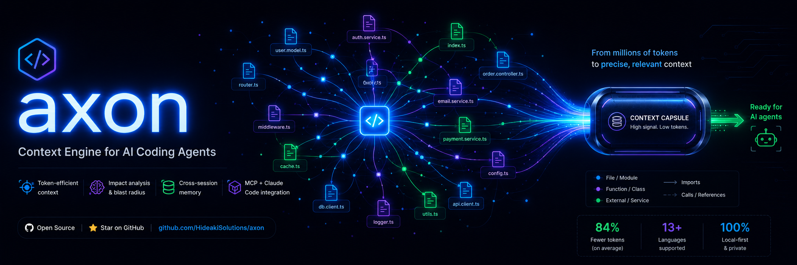
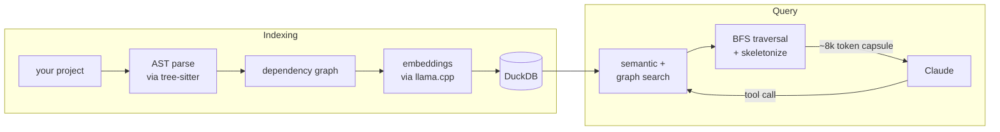
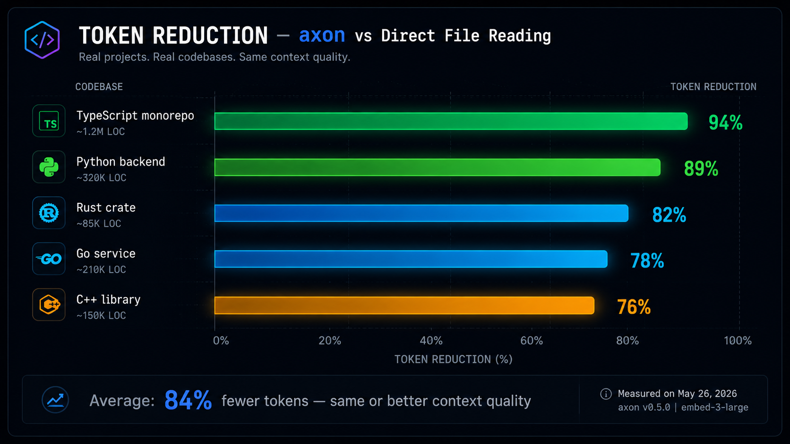
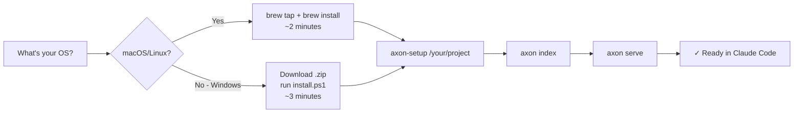
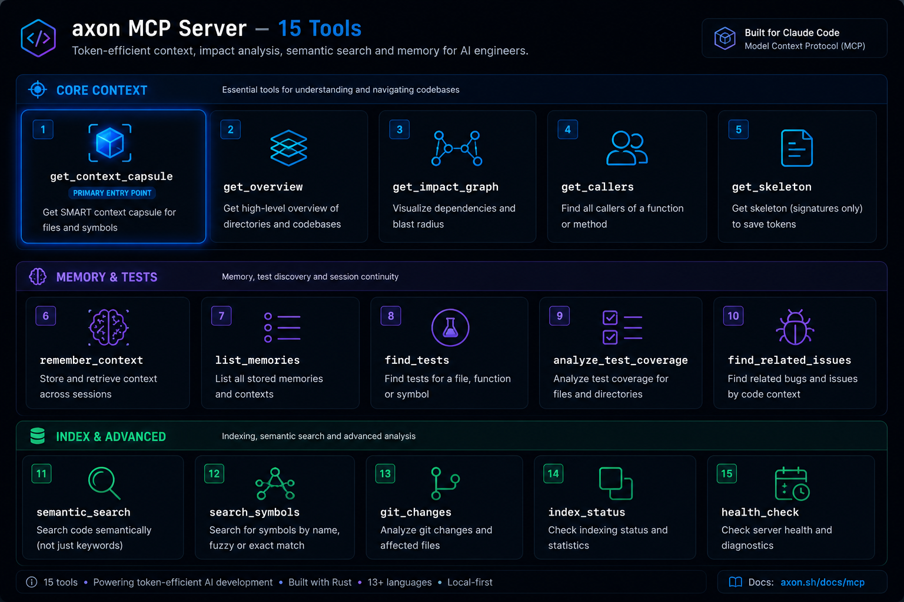
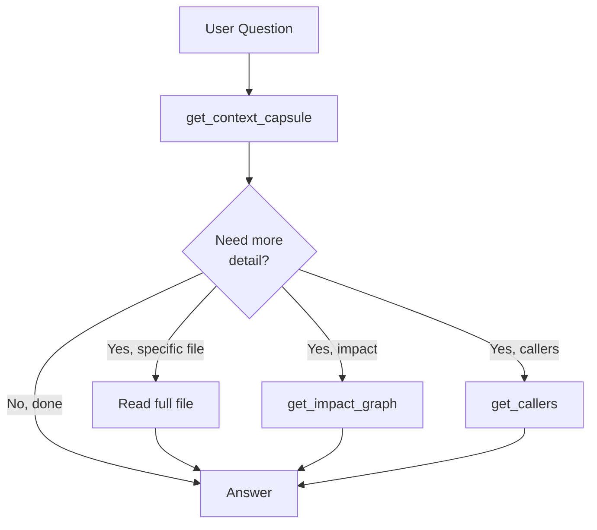
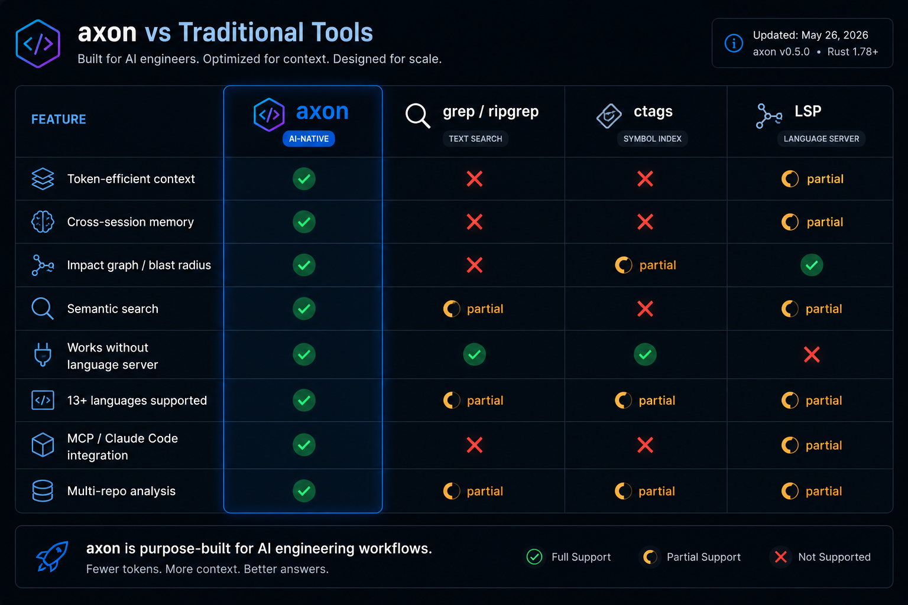
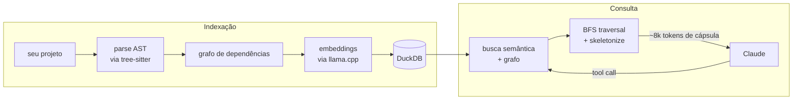
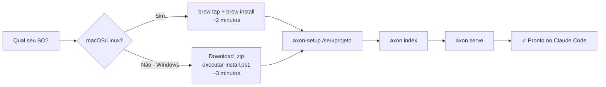

<p align="center">
  
</p>

[](LICENSE)
[](https://docs.anthropic.com/claude-code)
[](https://github.com/HideakiSolutions/axon-releases)
[](https://github.com/HideakiSolutions/homebrew-axon)
[](https://github.com/HideakiSolutions/axon-releases/releases/latest)

# axon — Context Engine for AI Coding Agents

**axon** is a local [MCP (Model Context Protocol)](https://modelcontextprotocol.io) server that delivers **surgical context** for AI coding agents. Instead of dumping entire files into the context window, axon builds a precise dependency graph of your codebase and assembles a token-budget-aware **context capsule** — only the pivot files and the relevant signatures of their dependencies.

It integrates directly with [Claude Code](https://docs.anthropic.com/claude-code) via MCP and responds to `get_context_capsule` and 14 other tools, all serving one goal:

> **Let the agent see exactly what it needs. Nothing more.**

---

## How It Works

<details>
<summary>Architecture diagram (Mermaid)</summary>



</details>

At index time, axon parses every file in your project using tree-sitter grammars, builds a symbol-level dependency graph, and optionally generates embeddings for semantic search — all stored locally in a DuckDB file inside `.axon/`.

At query time, the agent calls `get_context_capsule` (or any of the 14 other tools). Axon performs a BFS traversal of the graph starting from the most relevant pivot files, then **skeletonizes** support files (keeping only signatures, not bodies) until the token budget is met. The result is a compact, high-signal context capsule.

---

## Token Reduction — Real Measurements

| Project | Language | Without axon | With axon | Reduction |
|---------|----------|-------------|-----------|-----------|
| event-platform | TypeScript | 37,509 | 8,774 | **76%** |
| poynt-hub | TypeScript | 17,949 | 1,516 | **91%** |
| mcp-factory | Python | 22,480 | 1,389 | **93%** |
| event-platform | Python | 42,546 | 2,353 | **94%** |

### Cost Savings at 1,000 Calls/Day (Claude Sonnet — $3/M input tokens)

| | Without axon | With axon | Savings |
|---|---|---|---|
| Tokens / call | 37,509 | 8,774 | −76% |
| Cost / day | $112.50 | $26.32 | **−$86/day** |
| Cost / month | $3,375 | $790 | **−$2,585/month** |



---

## Installation



### Homebrew (recommended)

```bash
brew tap HideakiSolutions/axon
brew install axon
axon-setup /path/to/your-project
```

`axon-setup` indexes your project, downloads the embedding model (optional), and registers the MCP server with Claude Code automatically.

### Direct Download

Download the latest release from [GitHub Releases](https://github.com/HideakiSolutions/axon-releases/releases/latest).

**Linux x86-64 example:**

```bash
VERSION=0.5.5
curl -L -o axon.tar.gz \
  "https://github.com/HideakiSolutions/axon-releases/releases/download/v${VERSION}/axon-${VERSION}-linux-x64.tar.gz"
tar xzf axon.tar.gz && cd "axon-${VERSION}-linux-x64"
./install.sh /path/to/your-project
```

### Windows x64 — Direct download

> **Note:** Windows binaries are available from v0.5.6. For v0.5.5, use Linux or macOS.

```powershell
$VERSION = "0.5.6"
Invoke-WebRequest `
  "https://github.com/HideakiSolutions/axon-releases/releases/download/v$VERSION/axon-$VERSION-windows-x64.zip" `
  -OutFile "axon.zip"
Expand-Archive axon.zip -DestinationPath "axon-$VERSION-windows-x64"
cd "axon-$VERSION-windows-x64"
.\install.ps1 C:\path\to\your-project
```

After installation, add `axon.exe` to your PATH (optional — the installer configures Claude Code automatically):

```powershell
$env:PATH += ";$(Resolve-Path bin)"
```

### Available Platforms

| Platform | File |
|----------|------|
| Linux x86-64 | `axon-X.Y.Z-linux-x64.tar.gz` |
| macOS Apple Silicon | `axon-X.Y.Z-macos-arm64.tar.gz` |
| Windows x64 | `axon-0.5.6-windows-x64.zip` *(available from v0.5.6)* |

---

## Quick Start

```bash
# 1. Index your project
axon index /path/to/your-project

# 2. Check index status
axon status

# 3. Start MCP server (Claude Code connects automatically)
axon serve

# 4. Optional: HTTP mode for browser UI or external integrations
axon serve --http --port=7070
```

---

## Claude Code Integration

After running `axon-setup`, the MCP server is already registered. To configure manually, add to `~/.claude.json`:

```json
{
  "mcpServers": {
    "axon": {
      "command": "axon",
      "args": ["serve"]
    }
  }
}
```

> If installed via Homebrew, `axon` is in PATH — no full path needed.

Once registered, Claude Code will call axon's MCP tools automatically whenever it needs code context. No manual prompting required.

---

## All 15 MCP Tools



### Core Context Tools

| Tool | Parameters | Description |
|------|-----------|-------------|
| `get_context_capsule` | `query`, `pivot_files?`, `token_budget?` | Token-efficient context capsule — the primary entry point for most agent queries |
| `get_overview` | `limit?` | Top files by coupling + top referenced symbols — ideal for onboarding an unfamiliar codebase |
| `get_impact_graph` | `files[]` | Which files depend on the given files — blast radius before a refactor |
| `get_callers` | `symbol_name`, `file_path?`, `limit?` | Files that import the file defining a symbol — backward trace for debugging |
| `get_skeleton` | `files[]` | Signatures-only view (no function bodies) — fast structural inspection |
| `get_tests_for` | `files[]` | Test files that import the given files — test impact before merging |

### Memory Tools

| Tool | Parameters | Description |
|------|-----------|-------------|
| `search_memory` | `query`, `limit?` | Semantic search over saved observations across sessions |
| `save_observation` | `content`, `tags?`, `file_path?` | Persist an insight for future retrieval |

### Index Management

| Tool | Parameters | Description |
|------|-----------|-------------|
| `run_pipeline` | `root?` | Full project reindex |
| `index_paths` | `paths[]`, `prune?` | Incremental reindex of specific paths |

### Advanced Tools

| Tool | Parameters | Description |
|------|-----------|-------------|
| `rename` | `symbol_name`, `new_name`, `dry_run?` | Graph-assisted rename with impact preview |
| `route_map` | — | List all detected HTTP routes in the project |
| `api_impact` | `route_path` | Handler file + impact graph for an HTTP route |
| `detect_changes` | `since?` | Symbols and files affected by recent git changes |
| `group_list` / `group_impact` | — | Multi-repo registry and cross-repo blast radius |

---

## Agentic Workflow Patterns



| Dev flow | Canonical tool sequence |
|----------|------------------------|
| Semantic exploration | `get_context_capsule` |
| Onboarding / vibe coding | `get_overview` → `get_context_capsule` |
| Before refactor | `get_impact_graph` + `get_tests_for` |
| Debug / root cause | `get_callers` → `get_skeleton` → `get_context_capsule` |
| Quick structure inspection | `get_skeleton` |
| Cross-session memory | `search_memory` / `save_observation` |
| API change impact | `route_map` → `api_impact` |
| Git change blast radius | `detect_changes` |
| Multi-repo impact | `group_list` → `group_impact` |
| Graph-safe rename | `rename` |

### Worked Examples

**Before a refactor:**
```
get_impact_graph(files=["src/auth/middleware.ts"])
  → get_tests_for(files=["src/auth/middleware.ts"])
  → edit files with confidence
```

**Debugging a regression:**
```
get_callers(symbol_name="validateToken")
  → get_skeleton(files=[caller_files])     # narrow to real call sites
  → get_context_capsule(query="validateToken flow", pivot_files=[relevant_callers])
  → save_observation(content="root cause: ...", tags=["bug", "auth"])
```

**Onboarding a new codebase:**
```
get_overview(limit=10)
  → pick pivot of interest from top files / symbols
  → get_context_capsule(query="<derived question>")
  → save_observation(content="<mental map>", tags=["overview", "<project>"])
```

**Multi-repo blast radius:**
```
group_list()
  → group_impact(files=["packages/shared/event-types.ts"])
  → know exactly which repos are affected before publishing
```

---

## Supported Languages (13)

| Language | Extension(s) |
|----------|-------------|
| TypeScript | `.ts`, `.tsx` |
| JavaScript | `.js`, `.jsx`, `.mjs` |
| Python | `.py` |
| Rust | `.rs` |
| Go | `.go` |
| C# | `.cs` |
| PHP | `.php` |
| Dart | `.dart` |
| Java | `.java` |
| Bash | `.sh` |
| C++ | `.cpp`, `.cc`, `.h`, `.hpp` |
| Kotlin | `.kt`, `.kts` |
| Vue | `.vue` (with sub-parsed TypeScript/JavaScript) |

---

## HTTP Mode

Run axon as an HTTP server for browser-based UIs or external integrations:

```bash
# Single indexed project
axon serve --http --port=7070

# All registered repos
axon serve --http --port=7070 --all

# Specific group (multi-repo registry)
axon serve --http --port=7070 --group=backend
```

### REST Endpoints

| Method | Endpoint | Description |
|--------|----------|-------------|
| `GET` | `/api/graph` | Full dependency graph (JSON) |
| `GET` | `/api/symbol/:id` | Symbol detail + edges |
| `GET` | `/api/search?q=` | Semantic search over index |
| `GET` | `/api/observations` | Saved observations |
| `POST` | `/api/capsule` | Context capsule (same as MCP tool) |

---

## Configuration

### Project Config

```toml
# .axon/config.toml
granularity = "symbol"   # default: "file" — enables call-level edges for finer impact graphs
```

### Embedding Model (optional — enables semantic search)

```bash
# Download model during setup
axon-setup --download-model /path/to/your-project

# Or point to an existing model
export AXON_EMBEDDING_MODEL=/path/to/nomic-embed-text-v1.5.Q4_K_M.gguf
```

Without the model, all 15 tools work normally except `search_memory` and the semantic-query path of `get_context_capsule` (which falls back to graph-only traversal).

### Multi-Repo Registry

Register multiple projects in a named group for cross-repo impact analysis:

```bash
axon group add backend /path/to/api /path/to/workers /path/to/shared
axon serve --http --port=7070 --group=backend
```

---

## Comparison



| | axon | Naive file dump | RAG (embeddings-only) | AST-only tools |
|---|---|---|---|---|
| Token efficiency | ✅ 76–94% reduction | ❌ Full files | ✅ Selective | ✅ Selective |
| Dependency-aware | ✅ Graph BFS | ❌ None | ❌ Cosine similarity | ✅ Yes |
| Semantic search | ✅ Hybrid (graph + embed) | ❌ None | ✅ Embeddings | ❌ None |
| Cross-session memory | ✅ Persistent observations | ❌ None | ⚠️ External store needed | ❌ None |
| HTTP + browser UI | ✅ Built-in | ❌ None | ❌ None | ❌ None |
| Multi-repo blast radius | ✅ Group registry | ❌ None | ❌ None | ❌ None |
| Skeletonization | ✅ Signatures-only fallback | ❌ None | ❌ None | ✅ Partial |
| Works offline | ✅ Local DuckDB | ✅ | ❌ Often cloud | ✅ |
| MCP-native | ✅ 15 tools | ❌ None | ⚠️ Adapters vary | ⚠️ Varies |

---

## Roadmap

- [x] 15 MCP tools with full MCP protocol compliance
- [x] Write-through indexing (auto-reindex after edits in Claude Code)
- [x] Hybrid search (graph BFS + semantic embeddings)
- [x] HTTP mode with REST API
- [x] Multi-repo group registry and cross-repo blast radius
- [x] Route map and API impact analysis
- [x] `detect_changes` — git-aware change tracking
- [x] Graph-assisted rename
- [ ] Language Server Protocol (LSP) integration
- [ ] axon-web visual explorer (browser UI for graph navigation)
- [ ] VS Code extension
- [ ] Support for additional languages (Ruby, Swift, Scala)
- [ ] Watch mode (continuous background indexing)

---

## Documentation

Full documentation is available in the `docs/` directory:

| Document | EN | PT-BR |
|----------|-----|-------|
| Getting Started | [docs/en/getting-started.md](docs/en/getting-started.md) | [docs/pt-br/getting-started.md](docs/pt-br/getting-started.md) |
| CLI Reference | [docs/en/cli-reference.md](docs/en/cli-reference.md) | [docs/pt-br/cli-reference.md](docs/pt-br/cli-reference.md) |
| MCP Tools | [docs/en/mcp-tools.md](docs/en/mcp-tools.md) | [docs/pt-br/mcp-tools.md](docs/pt-br/mcp-tools.md) |
| Configuration | [docs/en/configuration.md](docs/en/configuration.md) | [docs/pt-br/configuration.md](docs/pt-br/configuration.md) |
| Workflows | [docs/en/workflows.md](docs/en/workflows.md) | [docs/pt-br/workflows.md](docs/pt-br/workflows.md) |

---

## Getting Help

- **Bug reports & feature requests:** [GitHub Issues](https://github.com/HideakiSolutions/axon-releases/issues)
- **Questions & discussion:** [GitHub Discussions](https://github.com/HideakiSolutions/axon-releases/discussions)

---

## License

MIT — see [LICENSE](LICENSE).

---

<p align="center">
  
</p>

# axon — Motor de Contexto para Agentes de IA com Código

**axon** é um servidor [MCP (Model Context Protocol)](https://modelcontextprotocol.io) local que entrega **contexto cirúrgico** para agentes de IA que trabalham com código. Em vez de despejar arquivos inteiros na janela de contexto, o axon constrói um grafo preciso de dependências do seu projeto e monta uma **cápsula de contexto** com orçamento de tokens — apenas os arquivos-pivô e as assinaturas relevantes de suas dependências.

Integra-se diretamente ao [Claude Code](https://docs.anthropic.com/claude-code) via MCP e responde a `get_context_capsule` e mais 14 ferramentas, todas com um único objetivo:

> **Deixar o agente ver exatamente o que precisa. Nada mais.**

---

## Como Funciona

<details>
<summary>Diagrama de arquitetura (Mermaid)</summary>



</details>

Na indexação, o axon parseia todos os arquivos do projeto com grammars tree-sitter, constrói um grafo de dependências em nível de símbolo e opcionalmente gera embeddings para busca semântica — tudo armazenado localmente em um arquivo DuckDB dentro de `.axon/`.

Na consulta, o agente chama `get_context_capsule` (ou qualquer uma das 14 outras ferramentas). O axon realiza um BFS no grafo a partir dos arquivos-pivô mais relevantes e **skeletoniza** os arquivos de suporte (mantendo apenas assinaturas, sem corpos de função) até atingir o orçamento de tokens. O resultado é uma cápsula de contexto compacta e de alto sinal.

---

## Redução de Tokens — Medições Reais

| Projeto | Linguagem | Sem axon | Com axon | Redução |
|---------|-----------|----------|----------|---------|
| event-platform | TypeScript | 37.509 | 8.774 | **76%** |
| poynt-hub | TypeScript | 17.949 | 1.516 | **91%** |
| mcp-factory | Python | 22.480 | 1.389 | **93%** |
| event-platform | Python | 42.546 | 2.353 | **94%** |

### Economia de Custo em 1.000 Chamadas/Dia (Claude Sonnet — $3/M tokens de entrada)

| | Sem axon | Com axon | Economia |
|---|---|---|---|
| Tokens / chamada | 37.509 | 8.774 | −76% |
| Custo / dia | US$112,50 | US$26,32 | **−US$86/dia** |
| Custo / mês | US$3.375 | US$790 | **−US$2.585/mês** |


---

## Instalação



### Homebrew (recomendado)

```bash
brew tap HideakiSolutions/axon
brew install axon
axon-setup /caminho/para/seu-projeto
```

O `axon-setup` indexa o projeto, baixa o modelo de embeddings (opcional) e registra o servidor MCP no Claude Code automaticamente.

### Download Direto

Baixe a versão mais recente em [GitHub Releases](https://github.com/HideakiSolutions/axon-releases/releases/latest).

**Exemplo Linux x86-64:**

```bash
VERSION=0.5.5
curl -L -o axon.tar.gz \
  "https://github.com/HideakiSolutions/axon-releases/releases/download/v${VERSION}/axon-${VERSION}-linux-x64.tar.gz"
tar xzf axon.tar.gz && cd "axon-${VERSION}-linux-x64"
./install.sh /caminho/para/seu-projeto
```

### Windows x64 — Download direto

> **Nota:** Binários para Windows disponíveis a partir da v0.5.6. Para v0.5.5, use Linux ou macOS.

```powershell
$VERSION = "0.5.6"
Invoke-WebRequest `
  "https://github.com/HideakiSolutions/axon-releases/releases/download/v$VERSION/axon-$VERSION-windows-x64.zip" `
  -OutFile "axon.zip"
Expand-Archive axon.zip -DestinationPath "axon-$VERSION-windows-x64"
cd "axon-$VERSION-windows-x64"
.\install.ps1 C:\caminho\para\seu-projeto
```

Após a instalação, adicione `axon.exe` ao PATH (opcional — o instalador configura o Claude Code automaticamente):

```powershell
$env:PATH += ";$(Resolve-Path bin)"
```

### Plataformas Disponíveis

| Plataforma | Arquivo |
|------------|---------|
| Linux x86-64 | `axon-X.Y.Z-linux-x64.tar.gz` |
| macOS Apple Silicon | `axon-X.Y.Z-macos-arm64.tar.gz` |
| Windows x64 | `axon-0.5.6-windows-x64.zip` *(disponível a partir da v0.5.6)* |

---

## Início Rápido

```bash
# 1. Indexar o projeto
axon index /caminho/para/seu-projeto

# 2. Verificar status do índice
axon status

# 3. Iniciar servidor MCP (Claude Code conecta automaticamente)
axon serve

# 4. Opcional: modo HTTP para UI no browser ou integrações externas
axon serve --http --port=7070
```

---

## Integração com Claude Code

Após o `axon-setup`, o servidor MCP já está registrado. Para configurar manualmente, adicione ao `~/.claude.json`:

```json
{
  "mcpServers": {
    "axon": {
      "command": "axon",
      "args": ["serve"]
    }
  }
}
```

> Se instalado via Homebrew, `axon` já está no PATH — não é necessário caminho completo.

---

## As 15 Ferramentas MCP


### Ferramentas de Contexto

| Ferramenta | Parâmetros | Descrição |
|------------|-----------|-----------|
| `get_context_capsule` | `query`, `pivot_files?`, `token_budget?` | Cápsula de contexto com eficiência de tokens — ponto de entrada principal |
| `get_overview` | `limit?` | Top arquivos por acoplamento + top símbolos referenciados |
| `get_impact_graph` | `files[]` | Quais arquivos dependem dos arquivos fornecidos |
| `get_callers` | `symbol_name`, `file_path?`, `limit?` | Arquivos que importam o arquivo que define um símbolo |
| `get_skeleton` | `files[]` | Visão apenas de assinaturas (sem corpos de função) |
| `get_tests_for` | `files[]` | Arquivos de teste que importam os arquivos fornecidos |

### Ferramentas de Memória

| Ferramenta | Parâmetros | Descrição |
|------------|-----------|-----------|
| `search_memory` | `query`, `limit?` | Busca semântica em observações salvas entre sessões |
| `save_observation` | `content`, `tags?`, `file_path?` | Persistir um insight para recuperação futura |

### Gerenciamento de Índice

| Ferramenta | Parâmetros | Descrição |
|------------|-----------|-----------|
| `run_pipeline` | `root?` | Reindexação completa do projeto |
| `index_paths` | `paths[]`, `prune?` | Reindexação incremental de caminhos específicos |

### Ferramentas Avançadas

| Ferramenta | Parâmetros | Descrição |
|------------|-----------|-----------|
| `rename` | `symbol_name`, `new_name`, `dry_run?` | Rename assistido pelo grafo com prévia de impacto |
| `route_map` | — | Lista todas as rotas HTTP detectadas no projeto |
| `api_impact` | `route_path` | Arquivo handler + grafo de impacto para uma rota HTTP |
| `detect_changes` | `since?` | Símbolos e arquivos afetados por mudanças recentes no git |
| `group_list` / `group_impact` | — | Registro multi-repositório e blast radius entre repos |

---

## Padrões de Fluxo Agentic


| Fluxo de desenvolvimento | Sequência canônica de ferramentas |
|--------------------------|----------------------------------|
| Exploração semântica | `get_context_capsule` |
| Onboarding / vibe coding | `get_overview` → `get_context_capsule` |
| Antes de um refactor | `get_impact_graph` + `get_tests_for` |
| Debug / causa raiz | `get_callers` → `get_skeleton` → `get_context_capsule` |
| Inspeção rápida de estrutura | `get_skeleton` |
| Memória entre sessões | `search_memory` / `save_observation` |
| Impacto de mudança de API | `route_map` → `api_impact` |
| Blast radius de mudança git | `detect_changes` |
| Impacto multi-repositório | `group_list` → `group_impact` |
| Rename seguro pelo grafo | `rename` |

### Exemplos Práticos

**Antes de um refactor:**
```
get_impact_graph(files=["src/auth/middleware.ts"])
  → get_tests_for(files=["src/auth/middleware.ts"])
  → editar com confiança
```

**Depurando uma regressão:**
```
get_callers(symbol_name="validateToken")
  → get_skeleton(files=[caller_files])     # afunilar nos call sites reais
  → get_context_capsule(query="fluxo validateToken", pivot_files=[callers relevantes])
  → save_observation(content="causa raiz: ...", tags=["bug", "auth"])
```

**Onboarding em novo projeto:**
```
get_overview(limit=10)
  → escolher pivô de interesse nos top files / símbolos
  → get_context_capsule(query="<pergunta derivada>")
  → save_observation(content="<mapa mental>", tags=["overview", "<projeto>"])
```

**Blast radius multi-repositório:**
```
group_list()
  → group_impact(files=["packages/shared/event-types.ts"])
  → saber exatamente quais repos são afetados antes de publicar
```

---

## Linguagens Suportadas (13)

| Linguagem | Extensões |
|-----------|-----------|
| TypeScript | `.ts`, `.tsx` |
| JavaScript | `.js`, `.jsx`, `.mjs` |
| Python | `.py` |
| Rust | `.rs` |
| Go | `.go` |
| C# | `.cs` |
| PHP | `.php` |
| Dart | `.dart` |
| Java | `.java` |
| Bash | `.sh` |
| C++ | `.cpp`, `.cc`, `.h`, `.hpp` |
| Kotlin | `.kt`, `.kts` |
| Vue | `.vue` (com sub-parse TypeScript/JavaScript) |

---

## Modo HTTP

```bash
# Projeto único indexado
axon serve --http --port=7070

# Todos os repositórios registrados
axon serve --http --port=7070 --all

# Grupo específico (registro multi-repo)
axon serve --http --port=7070 --group=backend
```

### Endpoints REST

| Método | Endpoint | Descrição |
|--------|----------|-----------|
| `GET` | `/api/graph` | Grafo de dependências completo (JSON) |
| `GET` | `/api/symbol/:id` | Detalhes do símbolo + arestas |
| `GET` | `/api/search?q=` | Busca semântica no índice |
| `GET` | `/api/observations` | Observações salvas |
| `POST` | `/api/capsule` | Cápsula de contexto (igual à ferramenta MCP) |

---

## Configuração

### Config do Projeto

```toml
# .axon/config.toml
granularity = "symbol"   # padrão: "file" — habilita arestas no nível de chamada
```

### Modelo de Embeddings (opcional — habilita busca semântica)

```bash
# Baixar modelo durante o setup
axon-setup --download-model /caminho/para/seu-projeto

# Ou apontar para um modelo existente
export AXON_EMBEDDING_MODEL=/caminho/para/nomic-embed-text-v1.5.Q4_K_M.gguf
```

Sem o modelo, todas as 15 ferramentas funcionam normalmente, exceto `search_memory` e o caminho de query semântica de `get_context_capsule` (que usa apenas travessia de grafo como fallback).

---

## Comparação


| | axon | Dump de arquivos | RAG (só embeddings) | Ferramentas AST-only |
|---|---|---|---|---|
| Eficiência de tokens | ✅ Redução de 76–94% | ❌ Arquivos completos | ✅ Seletivo | ✅ Seletivo |
| Consciência de dependências | ✅ BFS no grafo | ❌ Nenhuma | ❌ Similaridade cosseno | ✅ Sim |
| Busca semântica | ✅ Híbrida (grafo + embed) | ❌ Nenhuma | ✅ Embeddings | ❌ Nenhuma |
| Memória entre sessões | ✅ Observações persistentes | ❌ Nenhuma | ⚠️ Store externo | ❌ Nenhuma |
| HTTP + UI no browser | ✅ Embutido | ❌ Nenhum | ❌ Nenhum | ❌ Nenhum |
| Blast radius multi-repo | ✅ Registro de grupos | ❌ Nenhum | ❌ Nenhum | ❌ Nenhum |
| Skeletonização | ✅ Fallback só assinaturas | ❌ Nenhum | ❌ Nenhum | ✅ Parcial |
| Funciona offline | ✅ DuckDB local | ✅ | ❌ Frequentemente na nuvem | ✅ |
| MCP nativo | ✅ 15 ferramentas | ❌ Nenhum | ⚠️ Adaptadores variados | ⚠️ Varia |

---

## Roadmap

- [x] 15 ferramentas MCP com conformidade total ao protocolo MCP
- [x] Indexação write-through (reindexação automática após edições no Claude Code)
- [x] Busca híbrida (BFS no grafo + embeddings semânticos)
- [x] Modo HTTP com API REST
- [x] Registro multi-repo e blast radius entre repositórios
- [x] Route map e análise de impacto de API
- [x] `detect_changes` — rastreamento de mudanças via git
- [x] Rename assistido pelo grafo
- [ ] Integração com Language Server Protocol (LSP)
- [ ] axon-web — explorador visual (UI no browser para navegação no grafo)
- [ ] Extensão para VS Code
- [ ] Suporte a linguagens adicionais (Ruby, Swift, Scala)
- [ ] Modo watch (indexação contínua em background)

---

## Documentação

A documentação completa está disponível no diretório `docs/`:

| Documento | EN | PT-BR |
|-----------|-----|-------|
| Introdução | [docs/en/getting-started.md](docs/en/getting-started.md) | [docs/pt-br/getting-started.md](docs/pt-br/getting-started.md) |
| Referência CLI | [docs/en/cli-reference.md](docs/en/cli-reference.md) | [docs/pt-br/cli-reference.md](docs/pt-br/cli-reference.md) |
| Ferramentas MCP | [docs/en/mcp-tools.md](docs/en/mcp-tools.md) | [docs/pt-br/mcp-tools.md](docs/pt-br/mcp-tools.md) |
| Configuração | [docs/en/configuration.md](docs/en/configuration.md) | [docs/pt-br/configuration.md](docs/pt-br/configuration.md) |
| Workflows | [docs/en/workflows.md](docs/en/workflows.md) | [docs/pt-br/workflows.md](docs/pt-br/workflows.md) |

---

## Ajuda

- **Bugs e solicitações de funcionalidades:** [GitHub Issues](https://github.com/HideakiSolutions/axon-releases/issues)
- **Perguntas e discussões:** [GitHub Discussions](https://github.com/HideakiSolutions/axon-releases/discussions)

---

## Licença

MIT — veja [LICENSE](LICENSE).
