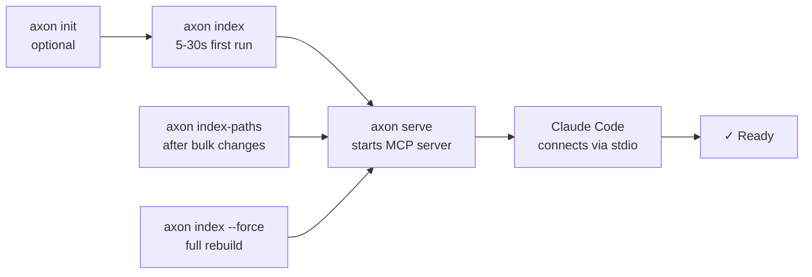
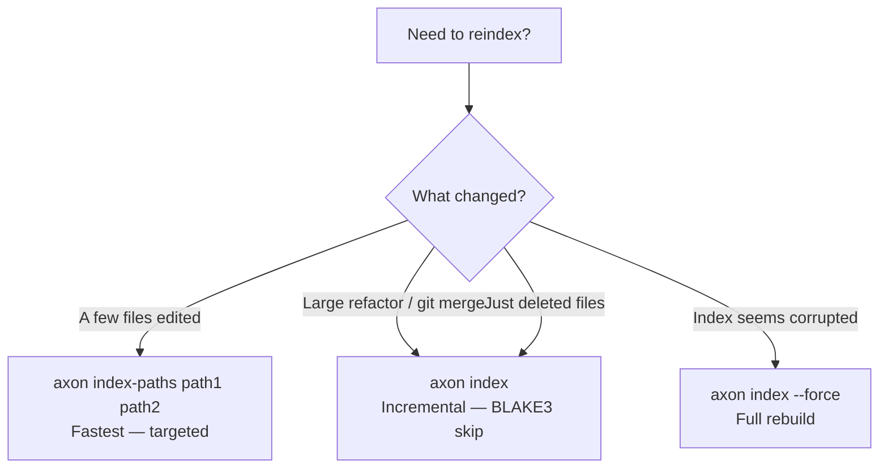
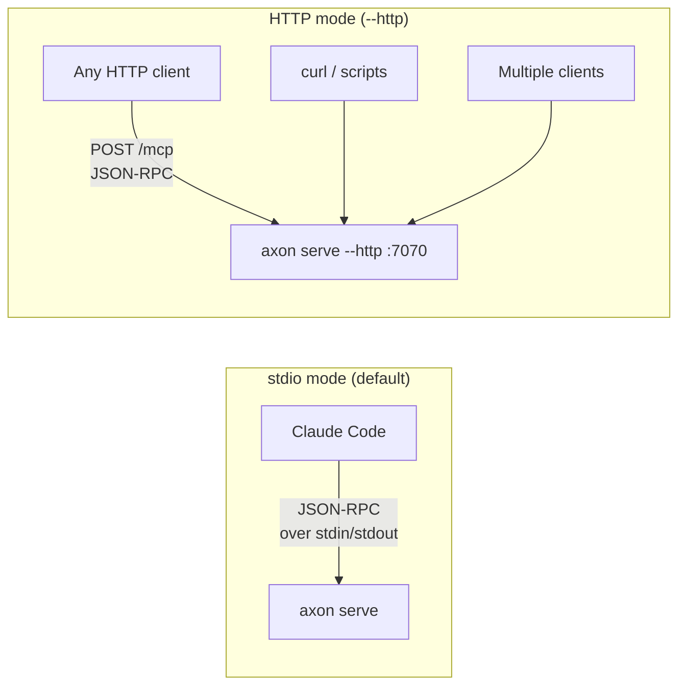
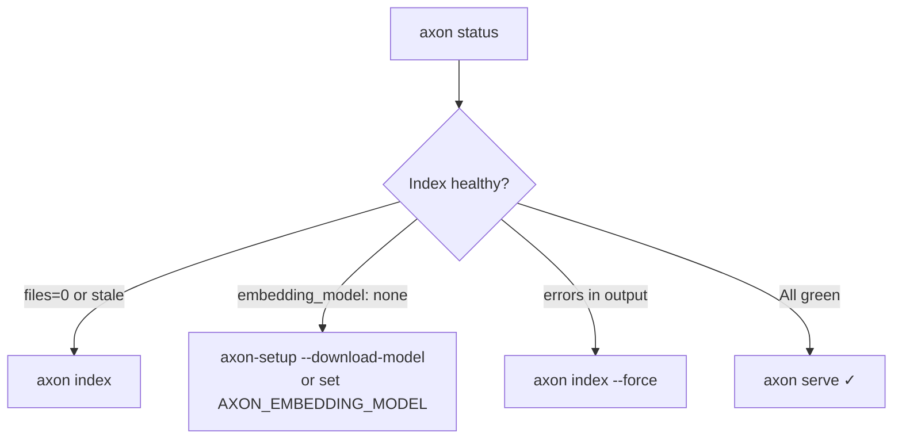

# CLI Reference

Complete reference for all `axon` command-line commands. Every command operates on the project in the current directory unless a `[path]` argument is given.

---

## Global Flags

| Flag | Description |
|------|-------------|
| `--version`, `-V` | Print version number and build SHA, then exit. |
| `--help`, `-h` | Print usage summary, then exit. |

---

## Happy Path Flow



---

## Commands

### `axon init`

Initialize a `.axon/config.toml` with default values in the project root.

**Syntax**

```
axon init [path]
```

**Arguments**

| Argument | Required | Description |
|----------|----------|-------------|
| `path` | No | Target project directory. Defaults to current working directory. |

**Description**

Creates `.axon/config.toml` at the specified path (or cwd) with default settings. If the file already exists, the command exits without modifying it — it is safe to run repeatedly.

Run `axon init` before `axon index` if you want to customize the configuration before the first index (for example, to set `granularity = "symbol"` before the initial parse).

**Examples**

```bash
# Initialize in the current directory
axon init

# Initialize in a specific project
axon init /path/to/your-project
```

---

### `axon index`

Parse all source files, build the dependency graph, and compute embeddings.

**Syntax**

```
axon index [path] [--force]
```

**Arguments**

| Argument | Required | Description |
|----------|----------|-------------|
| `path` | No | Project directory to index. Defaults to cwd. |

**Flags**

| Flag | Description |
|------|-------------|
| `--force` | Re-resolve edges and symbols even when the file hash is unchanged. Use after toggling `granularity` in `.axon/config.toml`. |

**Description**

Performs a full project index:
1. Walks the directory tree (respecting `.axonignore` and `.gitignore`).
2. Parses each file with tree-sitter grammars to extract symbols and import edges.
3. Resolves import paths to canonical file paths and writes the dependency graph to `.axon/index.duckdb`.
4. Computes vector embeddings for each file/symbol if `AXON_EMBEDDING_MODEL` is set.

File hashes are tracked — unchanged files are skipped unless `--force` is set. For incremental updates after editing specific files, prefer `axon index-paths` which is significantly faster.

The project is automatically registered in `~/.axon/registry.json` after a successful index.

**Examples**

```bash
# Index the current project
axon index

# Index a specific project path
axon index /path/to/your-project

# Force re-resolve all edges (required after changing granularity in config)
axon index --force
```

**Notes**

- First-time index on a large project (500k+ lines) may take a few minutes. Subsequent incremental indexes are fast.
- During normal use inside Claude Code, the write-through hook (`axon-post-edit.sh`) calls `axon index-paths` automatically after each file edit. Manual `axon index` is rarely needed.

#### Reindex Decision Tree



---

### `axon index-paths`

Incrementally reindex specific files. Much faster than a full reindex.

**Syntax**

```
axon index-paths <files...> [--prune]
```

**Arguments**

| Argument | Required | Description |
|----------|----------|-------------|
| `files...` | Yes (unless `--prune` alone) | One or more file paths to reindex. Paths can be absolute or relative to the project root. |

**Flags**

| Flag | Description |
|------|-------------|
| `--prune` | Sweep deleted files from the index. Can be used alone (no files) after deletions. |

**Description**

Re-parses and re-embeds only the specified files, then updates the dependency graph edges for those files. All other files remain unchanged in the index.

Use `--prune` after deleting or renaming files to remove stale entries from the DuckDB index without reprocessing the whole project.

**Examples**

```bash
# Reindex two specific files
axon index-paths src/auth.ts src/utils.ts

# Reindex a single file
axon index-paths src/api/routes/users.ts

# Prune deleted files without reindexing
axon index-paths --prune

# Reindex and prune in one pass
axon index-paths src/new-module.ts --prune
```

---

### `axon serve`

Start the MCP server (stdio JSON-RPC 2.0 mode) or an HTTP REST API server.

**Syntax**

```
axon serve [--http] [--port=N] [--host=ADDR] [--group=NAME] [--all]
```

**Flags**

| Flag | Default | Description |
|------|---------|-------------|
| `--http` | off | Switch to HTTP REST API mode instead of stdio MCP. |
| `--port=N` | `7070` | Port number for HTTP mode. |
| `--host=ADDR` | `127.0.0.1` | Bind address for HTTP mode. |
| `--all` | off | Aggregate all repos registered in `~/.axon/registry.json` (HTTP mode only). |
| `--group=NAME` | — | Aggregate only repos in the named group from the registry (HTTP mode only). |

**Description**

Without `--http`: starts a stdio MCP server that Claude Code connects to via the process configured in `~/.claude.json`. The server responds to JSON-RPC 2.0 requests from Claude Code and dispatches to the 15 MCP tools.

With `--http`: starts an HTTP REST API server. Useful for browser-based UIs, external integrations, or testing queries via `curl`. See `docs/en/configuration.md` for the available REST endpoints.

**Examples**

```bash
# Start MCP stdio server (standard Claude Code mode)
axon serve

# Start HTTP server on default port 7070
axon serve --http

# Start HTTP server on a custom port
axon serve --http --port=8080

# Serve all registered repos in aggregate (HTTP only)
axon serve --http --all

# Serve only the "backend" group (HTTP only)
axon serve --http --group=backend

# Bind to all interfaces (for remote access — use carefully)
axon serve --http --host=0.0.0.0 --port=7070
```

**Notes**

- In stdio mode, Claude Code manages the process lifecycle. You do not need to keep a terminal open.
- In HTTP mode, the server runs in the foreground. Use a process manager (systemd, launchd, `screen`) for persistent operation.
- `--all` and `--group` are only meaningful in HTTP mode.

#### Serve Modes Comparison



---

### `axon capsule`

Print a context capsule for a query to stdout.

**Syntax**

```
axon capsule <query> [--no-cache]
```

**Arguments**

| Argument | Required | Description |
|----------|----------|-------------|
| `query` | Yes | Natural-language query describing what context you need. |

**Flags**

| Flag | Description |
|------|-------------|
| `--no-cache` | Bypass the query-hash cache and force recomputation. |

**Description**

Assembles and prints the same context capsule that `get_context_capsule` would return inside Claude Code. Useful for scripting, CI pipelines, or debugging capsule output outside of an interactive session.

Output is plain text (the same format delivered to Claude Code as the MCP tool response).

**Examples**

```bash
# Test a capsule for a query
axon capsule "how does authentication work"

# Bypass cache and force recomputation
axon capsule "indexer entry point" --no-cache

# Pipe to a pager for long output
axon capsule "database connection management" | less

# Save capsule to file
axon capsule "payment flow" > payment-context.txt
```

---

### `axon skeleton`

Print a signatures-only view of a file.

**Syntax**

```
axon skeleton <file>
```

**Arguments**

| Argument | Required | Description |
|----------|----------|-------------|
| `file` | Yes | Path to the source file. Relative to project root or absolute. |

**Description**

Outputs the file's symbols (functions, classes, methods, interfaces, types) with their signatures and docstrings — but without function bodies. Equivalent to calling the `get_skeleton` MCP tool on a single file.

Useful for quickly understanding a module's public API without reading the full implementation.

**Examples**

```bash
# Show signatures for a TypeScript file
axon skeleton src/auth/token.ts

# Show signatures for a Python module
axon skeleton app/services/payment.py

# Pipe to a file for inspection
axon skeleton src/api/router.ts > router-api.txt
```

---

### `axon status`

Show index statistics and health information.

**Syntax**

```
axon status
```

**Description**

Prints a summary of the current index:

- Number of indexed files
- Number of extracted symbols
- Number of dependency edges
- Number of saved observations
- Cache hit count for the current server session
- Index age (time since last full index)
- Embedding model status (loaded / not configured)

Use this to verify that the index is fresh and the model is available before starting a Claude Code session.

**Example**

```bash
axon status
```

Example output:

```
axon index status
  Project : /home/user/my-project
  Files   : 312
  Symbols : 4,871
  Edges   : 9,204
  Obs.    : 14 observations saved
  Age     : 3 hours ago
  Model   : nomic-embed-text-v1.5 (loaded)
  Cache   : 127 hits
```

#### Diagnostic Flow



---

### `axon help`

Show a usage summary of all available commands.

**Syntax**

```
axon help
```

---

### `axon --version`

Print the version number and git SHA of the build.

**Syntax**

```
axon --version
axon -V
```

**Example**

```bash
axon --version
# → axon 0.5.5 (build a0db696)
```

---

## Environment Variables

Environment variables that affect CLI behavior are documented in the [Configuration](configuration.md) reference.

## Exit Codes

| Code | Meaning |
|------|---------|
| `0` | Success |
| `1` | General error (missing argument, file not found, etc.) |
| `2` | Index not found — run `axon index` first |
| `3` | Embedding model error (bad path, unsupported format) |
