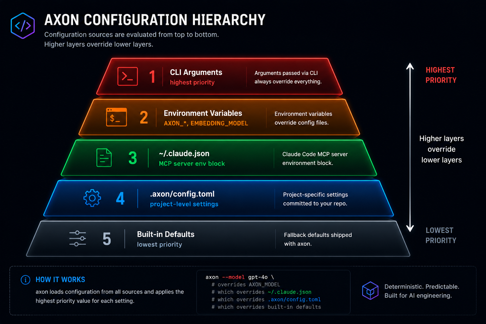
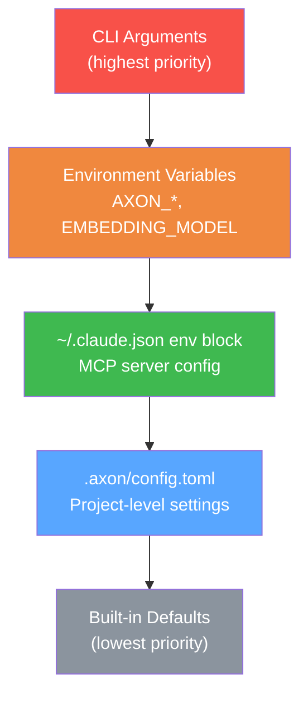
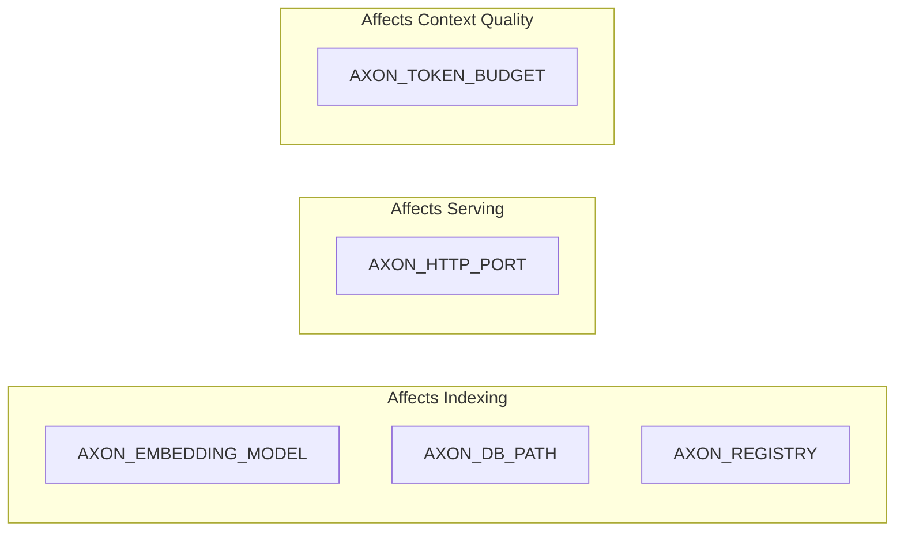
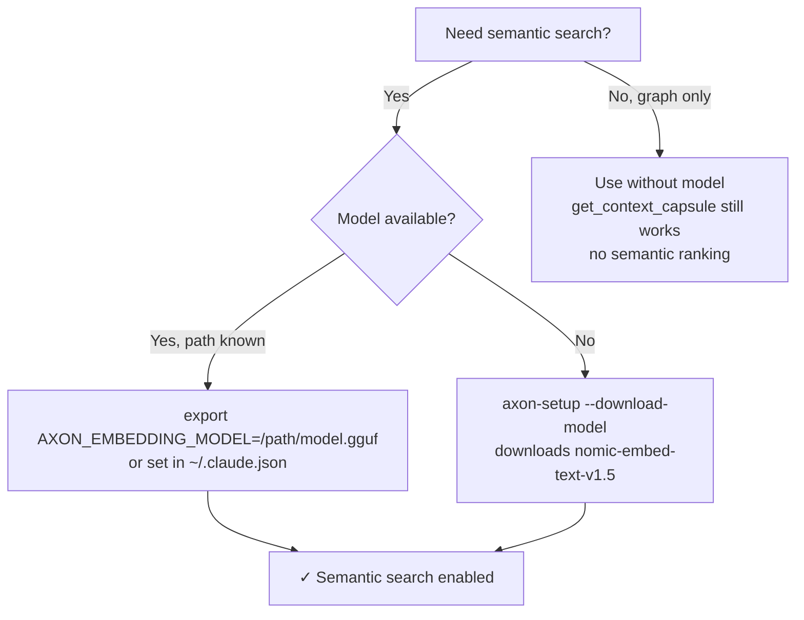
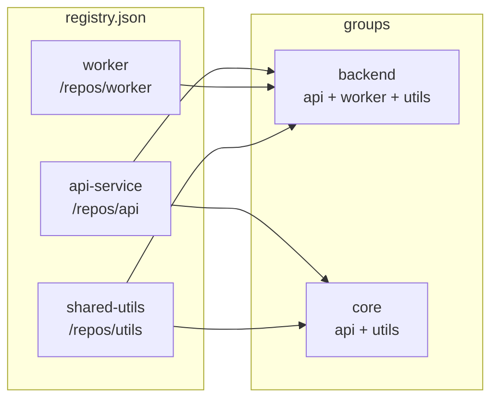

# Configuration Reference

axon is configured through three mechanisms: a per-project TOML file, environment variables, and the Claude Code MCP registration in `~/.claude.json`. A fourth optional file, `.axonignore`, controls which files are excluded from indexing.





---

## Per-Project Configuration — `.axon/config.toml`

Created automatically by `axon init` or `axon index` inside the project root. Edit manually to customize indexing behavior.

### `granularity`

Controls the depth of the dependency graph.

```toml
# .axon/config.toml

granularity = "symbol"   # "file" (default) or "symbol"
```

| Value | Description |
|-------|-------------|
| `"file"` | **(Default)** Import-level graph. Edges connect files to the files they import. Fast and sufficient for most projects. |
| `"symbol"` | Call-level graph. Edges connect individual functions and classes to the specific symbols they call or extend. Enables finer-grained BFS in `get_impact_graph` and `get_callers`. Slower to index but more precise. |

**When to use `"symbol"`:**
- Large codebases where file-level blast radius is too broad.
- When `get_callers` results need to be narrowed to specific call sites.
- Microservices with well-defined module boundaries.

**Important:** After changing `granularity`, you must re-resolve the entire graph:

```bash
axon index --force
```

Without `--force`, unchanged file hashes are skipped and the graph will be inconsistent.

---

## Environment Variables



Set these in your shell profile (`~/.bashrc`, `~/.zshrc`) or in the `env` block of `~/.claude.json`.

### `AXON_EMBEDDING_MODEL`

```
AXON_EMBEDDING_MODEL=/path/to/nomic-embed-text-v1.5.Q4_K_M.gguf
```

**Required for:**
- `search_memory` — semantic search over saved observations.
- Semantic-query mode of `get_context_capsule` — higher-quality pivot selection by vector similarity.

**Without this variable:**
- All 15 tools work normally.
- `get_context_capsule` falls back to graph-centrality-only pivot selection.
- `search_memory` returns empty results.

**Recommended model:** `nomic-embed-text-v1.5.Q4_K_M.gguf` (~80 MB). Download via:

```bash
axon-setup --download-model /path/to/your-project
```

Or set `AXON_DOWNLOAD_MODEL=1` to download automatically during setup (see below).



---

### `AXON_TOKEN_BUDGET`

```
AXON_TOKEN_BUDGET=8192
```

Default token budget for context capsules. This is the maximum number of tokens axon will include in a single `get_context_capsule` response.

Can be overridden per-call via the `token_budget` parameter.

**Typical values:**
- `4096` — tight budget, fast responses, may omit some support files.
- `8192` — **(default)** balanced; works well for most queries.
- `16384` — wide budget for complex multi-file queries; increases Claude API cost proportionally.

---

### `AXON_TELEMETRY`

```
AXON_TELEMETRY=0
```

| Value | Behavior |
|-------|----------|
| `0` | **(Default)** Telemetry disabled. |
| `1` | Telemetry opt-in. Currently a no-op — the telemetry endpoint design is in progress. No data is sent in this version. |

---

### `AXON_DOWNLOAD_MODEL`

```
AXON_DOWNLOAD_MODEL=1
```

When set to `1`, `axon-setup` downloads the embedding model automatically without displaying an interactive prompt. Useful for CI environments or automated provisioning scripts.

---

### `AXON_MODEL_DIR`

```
AXON_MODEL_DIR=/path/to/models
```

Directory where `axon-setup --download-model` saves the embedding model file.

**Default:** `<install-dir>/models/` (relative to the axon binary location).

---

### `AXON_DB_PATH`

Path to the DuckDB index file. Defaults to `.axon/index.duckdb` relative to the project root.

```bash
export AXON_DB_PATH=/shared/indexes/myproject.duckdb
```

Useful when storing indexes on a separate volume or sharing an index across multiple working directories.

---

### `AXON_REGISTRY`

Path to a [multi-repo registry file](registry.json). When set, axon loads cross-repo group definitions from this file, enabling `group_list` and `group_impact` tools.

```bash
export AXON_REGISTRY=/opt/projects/registry.json
```

---

### `AXON_HTTP_PORT`

Port for HTTP mode (`axon serve --http`). Defaults to `7070`.

```bash
export AXON_HTTP_PORT=8080
axon serve --http
```

---

## Claude Code MCP Configuration — `~/.claude.json`

Register axon as a Claude Code MCP server so Claude can call the 15 tools automatically.

### Minimal configuration (no embedding model)

```json
{
  "mcpServers": {
    "axon": {
      "command": "axon",
      "args": ["serve"]
    }
  }
}
```

### With embedding model

```json
{
  "mcpServers": {
    "axon": {
      "command": "axon",
      "args": ["serve"],
      "env": {
        "AXON_EMBEDDING_MODEL": "/path/to/nomic-embed-text-v1.5.Q4_K_M.gguf"
      }
    }
  }
}
```

### With full environment configuration

```json
{
  "mcpServers": {
    "axon": {
      "command": "axon",
      "args": ["serve"],
      "env": {
        "AXON_EMBEDDING_MODEL": "/home/user/models/nomic-embed-text-v1.5.Q4_K_M.gguf",
        "AXON_TOKEN_BUDGET": "12000"
      }
    }
  }
}
```

### For direct-download installs (binary not in PATH)

If you installed via tarball and the binary is not in your system PATH, use the full path:

```json
{
  "mcpServers": {
    "axon": {
      "command": "/usr/local/bin/axon",
      "args": ["serve"],
      "env": {
        "AXON_EMBEDDING_MODEL": "/path/to/nomic-embed-text-v1.5.Q4_K_M.gguf"
      }
    }
  }
}
```

**After any change to `~/.claude.json`, restart Claude Code for the new configuration to take effect.**

---

## Multi-Repo Registry — `~/.axon/registry.json`

axon maintains a global registry of indexed projects. It is auto-populated every time you run `axon index` in a project. You rarely need to edit it manually, but the format is documented here for advanced use.

### Auto-registration

Running `axon index /path/to/project` automatically adds or updates an entry in `~/.axon/registry.json`. No manual action needed.

### Manual format

```json
{
  "repos": [
    {
      "name": "my-api",
      "root": "/path/to/my-api",
      "db_path": "/path/to/my-api/.axon/index.duckdb"
    },
    {
      "name": "shared-lib",
      "root": "/path/to/shared-lib",
      "db_path": "/path/to/shared-lib/.axon/index.duckdb"
    },
    {
      "name": "frontend",
      "root": "/path/to/frontend",
      "db_path": "/path/to/frontend/.axon/index.duckdb"
    }
  ],
  "groups": {
    "backend": ["my-api", "shared-lib"],
    "all-services": ["my-api", "shared-lib", "frontend"]
  }
}
```



**Fields:**

| Field | Description |
|-------|-------------|
| `repos[].name` | Display name used by `group_list` and `--group=NAME` flag. |
| `repos[].root` | Absolute path to the project root. |
| `repos[].db_path` | Absolute path to the project's DuckDB index file. |
| `groups` | Named collections of repo names. Used with `axon serve --group=NAME` and `group_impact`. |

### Group commands (shorthand)

Instead of editing JSON manually, use the CLI:

```bash
# Register repos into a named group
axon group add backend /path/to/my-api /path/to/shared-lib

# Start HTTP server for a group
axon serve --http --group=backend
```

---

## `.axonignore` — Excluding Files from Indexing

Place a `.axonignore` file in the project root to exclude files and directories from indexing. The format follows gitignore syntax.

```gitignore
# Exclude build output and dependencies
node_modules/
dist/
build/
.next/
target/

# Exclude generated files
**/*.generated.ts
**/*.pb.go

# Exclude test fixtures (but still index test files themselves)
tests/fixtures/
__fixtures__/

# Negation: re-include a specific file that would otherwise be excluded
!src/generated/important-schema.ts

# Anchored patterns (relative to project root)
/vendor/
/third_party/

# Exclude by extension
*.min.js
*.bundle.js
```

**Syntax rules (same as `.gitignore`):**

| Pattern | Effect |
|---------|--------|
| `node_modules/` | Exclude directory by name, anywhere in the tree |
| `/vendor/` | Exclude only at project root |
| `**/*.generated.ts` | Exclude all `.generated.ts` files recursively |
| `!src/important.ts` | Re-include a file that matched a previous exclusion |
| `*.min.js` | Exclude all `.min.js` files |
| `# comment` | Comment line, ignored |

**Note:** axon also respects `.gitignore` automatically. You only need `.axonignore` for patterns that should be excluded from indexing but not from git tracking (e.g., large binary assets or third-party vendored code that is tracked in git but irrelevant for context).
