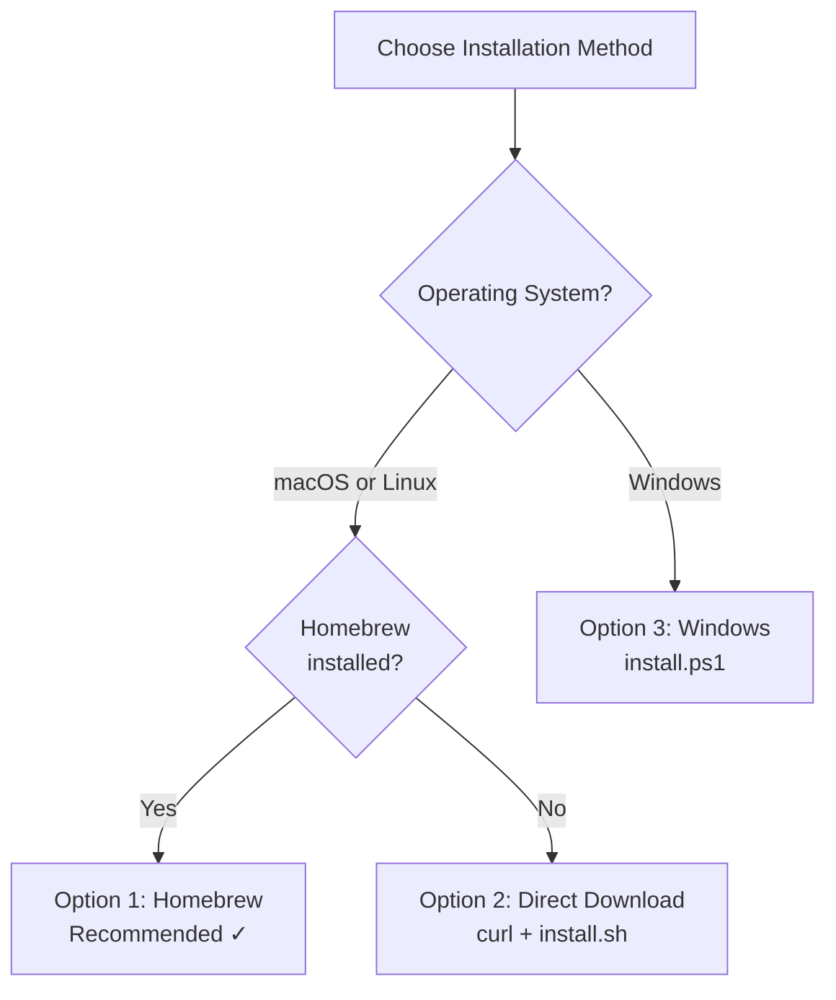
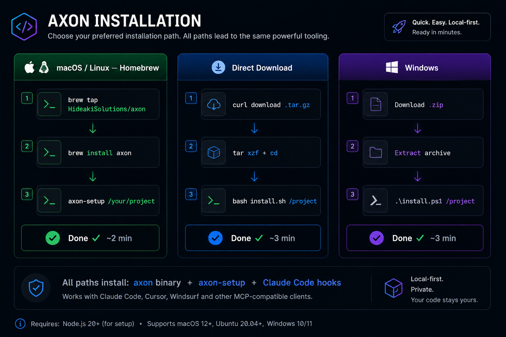
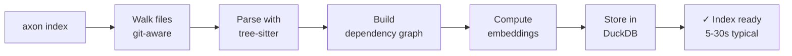
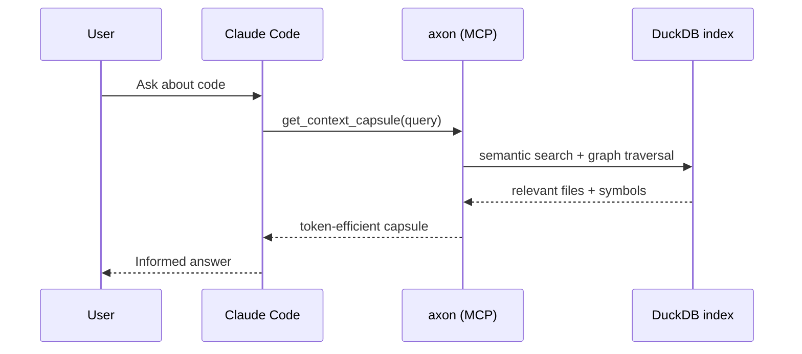

# Getting Started with axon

**axon** is a local MCP (Model Context Protocol) server that gives AI coding agents surgical context — assembling token-budget-aware capsules from your codebase instead of dumping raw file content into the context window.

This guide takes you from zero to your first `get_context_capsule` query in Claude Code.

---

## Prerequisites

| Requirement | Notes |
|-------------|-------|
| **jq** | Required by `axon-setup` for JSON manipulation. Install with `brew install jq` (macOS) or `apt install jq` (Debian/Ubuntu). |
| **git** | Required for `detect_changes` and repo registration. Usually pre-installed. |
| **No build tools** | Not required | axon ships as a pre-built binary — no compiler needed. |

---

## Installation





### Option 1 — Homebrew (recommended for macOS and Linux)

```bash
brew tap HideakiSolutions/axon
brew install axon
```

After installation, run the setup wizard to index your project, optionally download the embedding model, and register axon with Claude Code automatically:

```bash
axon-setup /path/to/your-project
```

That's it. Skip to [First Index](#first-index) if you want to understand what `axon-setup` does under the hood, or jump to [Configure Claude Code](#configure-claude-code-manually) if you need manual control.

---

### Option 2 — Direct Download (Linux / macOS tarball)

1. Find the latest version at [GitHub Releases](https://github.com/HideakiSolutions/axon-releases/releases/latest).

2. Download and extract:

```bash
VERSION=0.5.5

# Linux x86-64
curl -L -o axon.tar.gz \
  "https://github.com/HideakiSolutions/axon-releases/releases/download/v${VERSION}/axon-${VERSION}-linux-x64.tar.gz"

# macOS Apple Silicon
# curl -L -o axon.tar.gz \
#   "https://github.com/HideakiSolutions/axon-releases/releases/download/v${VERSION}/axon-${VERSION}-macos-arm64.tar.gz"

tar xzf axon.tar.gz
cd "axon-${VERSION}-linux-x64"
```

3. Run the installer:

```bash
./install.sh /path/to/your-project
```

`install.sh` copies the binary to a location in your PATH, indexes your project, and configures Claude Code's `~/.claude.json`.

---

### Option 3 — Windows x64

```powershell
$VERSION = "0.5.5"
Invoke-WebRequest `
  "https://github.com/HideakiSolutions/axon-releases/releases/download/v$VERSION/axon-$VERSION-windows-x64.zip" `
  -OutFile "axon.zip"
Expand-Archive axon.zip -DestinationPath "axon-$VERSION-windows-x64"
cd "axon-$VERSION-windows-x64"
.\install.ps1 C:\path\to\your-project
```

To add `axon.exe` to PATH for the current session:

```powershell
$env:PATH += ";$(Resolve-Path bin)"
```

---

## First Index

Whether you used `axon-setup` or installed manually, indexing a project is the same command:

```bash
axon index /path/to/your-project
```

axon will:
1. Walk all source files in the directory tree (respecting `.axonignore` and `.gitignore`).
2. Parse each file with tree-sitter grammars to extract symbols and edges.
3. Build a dependency graph and store it in `.axon/index.duckdb` inside the project root.
4. Optionally compute embeddings for semantic search (if `AXON_EMBEDDING_MODEL` is set).

Indexing a medium-sized project (10k–50k lines) typically takes 5–30 seconds. Large monorepos with 500k+ lines may take a few minutes on first index; incremental re-indexes are much faster.



---

## Check Status

After indexing, verify the index is healthy:

```bash
axon status
```

Example output:

```
axon index status
  Project : /path/to/your-project
  Files   : 312
  Symbols : 4,871
  Edges   : 9,204
  Obs.    : 0 observations saved
  Age     : 2 minutes ago
  Model   : nomic-embed-text-v1.5 (loaded)
  Cache   : 0 hits
```

If the model line shows `not configured`, semantic search will fall back to graph-only traversal — all other tools work normally. See [Embedding Model](#optional-embedding-model-for-semantic-search) below.

---

## Start the MCP Server

Claude Code communicates with axon over stdio MCP. Start the server:

```bash
axon serve
```

The server runs in the foreground, listening on stdin/stdout for JSON-RPC 2.0 messages. Claude Code manages the process lifecycle automatically once configured — you do not need to start `axon serve` manually each session.

---

## Configure Claude Code Manually

If `axon-setup` did not run (or you want to verify the configuration), add the following to `~/.claude.json`:

```json
{
  "mcpServers": {
    "axon": {
      "command": "axon",
      "args": ["serve"],
      "env": {
        "AXON_EMBEDDING_MODEL": "/path/to/nomic-embed-text-v1.5.Q4_K_M.gguf"
      }
    }
  }
}
```



**Notes:**
- If installed via Homebrew, `axon` is already in PATH — the `command` field works as-is.
- For direct-download installs, use the full binary path: `"command": "/usr/local/bin/axon"`.
- The `AXON_EMBEDDING_MODEL` env var is optional. Omit it if you do not have the model file.
- Restart Claude Code after modifying `~/.claude.json`.

---

## Optional: Embedding Model for Semantic Search

axon supports a local embedding model for semantic-query mode in `get_context_capsule` and for `search_memory`. Without it, all 15 tools still work — `get_context_capsule` falls back to graph-only traversal.

### Download the model automatically

```bash
axon-setup --download-model /path/to/your-project
```

### Download manually

The recommended model is `nomic-embed-text-v1.5.Q4_K_M.gguf` (~80 MB). After downloading, set the environment variable:

```bash
export AXON_EMBEDDING_MODEL=/path/to/nomic-embed-text-v1.5.Q4_K_M.gguf
```

Add this to your shell profile (`~/.bashrc`, `~/.zshrc`) or set it in `~/.claude.json` under the `env` key (see above).

---

## Your First Query in Claude Code

Once axon is indexed and the MCP server is configured, Claude Code will call axon's tools automatically whenever it needs code context. You do not need to invoke them manually.

To trigger your first context capsule, open a Claude Code session in your project and ask something like:

```
How does authentication work in this codebase?
```

Claude Code will call `get_context_capsule(query="how does authentication work")` behind the scenes, receive a token-efficient capsule of the relevant files, and answer with precise context — without reading every file.

You can also ask Claude Code to run specific tools explicitly:

```
Use get_overview to show me the most important files in this project.
```

```
Run get_impact_graph on src/auth/middleware.ts so I know what would break if I change it.
```

---

## Next Steps

| Topic | Document |
|-------|----------|
| All CLI commands with flags and examples | [CLI Reference](cli-reference.md) |
| All 15 MCP tools with parameters and usage | [MCP Tools](mcp-tools.md) |
| Configuration files and environment variables | [Configuration](configuration.md) |
| Agentic workflow patterns with step-by-step prompts | [Workflows](workflows.md) |
