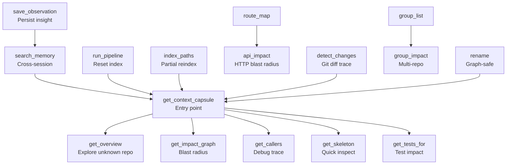
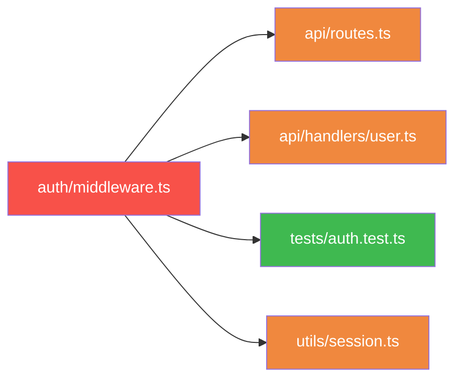
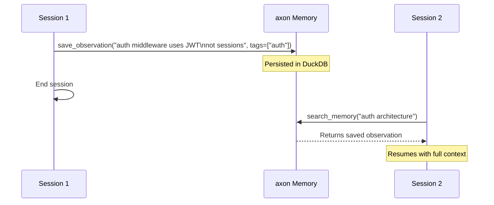
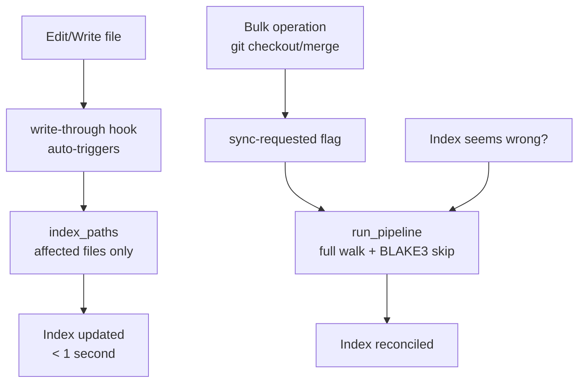

# MCP Tools Reference

axon exposes 15 MCP tools to Claude Code via the JSON-RPC 2.0 protocol. Each tool is documented below with its purpose, parameters, return value, recommended usage scenario, and a concrete example.

Claude Code invokes these tools automatically based on context. You can also trigger them explicitly by describing what you want in natural language.



---

## Core Context Tools

---

### 1. `get_context_capsule`

**Purpose**

Assembles a token-budget-aware context capsule for a natural-language query. Pivot files — the most relevant files for the query — arrive in full; support files (their dependencies and dependents) arrive skeletonized (signatures only, no function bodies). The result is a compact, high-signal package of exactly the context an agent needs.

This is the primary entry point for most agentic tasks.

**Parameters**

| Name | Type | Required | Description |
|------|------|----------|-------------|
| `query` | string | Yes | Natural-language description of what you need context for. Example: `"how does JWT validation work"` |
| `pivot_files` | string[] | No | Steer which files are treated as primary pivots. Paths relative to project root. When omitted, axon selects pivots via semantic + graph search. |
| `token_budget` | integer | No | Maximum tokens to include in the capsule. Default: 8192. Override with `AXON_TOKEN_BUDGET` env var. |

**Returns**

Assembled capsule text containing:
- A header comment listing pivot files and their roles
- Full source of pivot files (up to budget)
- Skeletonized source of support files (signatures only, filling remaining budget)
- Truncation markers if additional files were found but excluded

**When to Use**

Any time you need to understand a feature, trace a bug, explore a subsystem, or get context before making a change. Run this before reading individual files manually.

**Example**

Claude Code prompt:
```
How does the rate limiter work in this project?
```

Equivalent explicit MCP call:
```
get_context_capsule(query="how does the rate limiter work")
```

With pivot steering:
```
get_context_capsule(
  query="JWT validation flow",
  pivot_files=["src/auth/jwt.ts", "src/middleware/auth.ts"],
  token_budget=12000
)
```

**Notes**

- Results are cached by `hash(query + token_budget)` per index epoch. The cache invalidates automatically after any reindex.
- Use `axon capsule <query> --no-cache` from the CLI to bypass the cache.
- Without `AXON_EMBEDDING_MODEL`, the semantic-search phase is skipped and pivots are selected via graph centrality only.

---

### 2. `get_overview`

**Purpose**

Returns the most-coupled files and most-referenced symbols in the project — the "nervous center" of the codebase. Use this to orient yourself before any other query.

**Parameters**

| Name | Type | Required | Description |
|------|------|----------|-------------|
| `limit` | integer | No | Number of top files and top symbols to return. Default: 10. |

**Returns**

Two ranked lists:
1. Top N files by incoming edge count (most imported / most depended on)
2. Top N symbols by reference count (most called / most used)

**When to Use**

- Onboarding a new codebase you have never seen before.
- Starting a session without a specific task — get oriented first.
- Identifying the most impactful files before a broad refactor.

**Example**

Claude Code prompt:
```
Give me an overview of this codebase.
```

Explicit call:
```
get_overview(limit=15)
```

---

### 3. `get_impact_graph`

**Purpose**

Bidirectional BFS traversal — which files depend on the given files (and which files the given files depend on). Reveals the blast radius of a change before you make it.



**Parameters**

| Name | Type | Required | Description |
|------|------|----------|-------------|
| `files` | string[] | Yes | Paths relative to project root. One or more files to analyze. |

**Returns**

A list of dependent files with relationship type for each edge:
- `imports` — direct import
- `calls` — symbol-level call (requires `granularity = "symbol"` in config)
- `extends` — class inheritance

**When to Use**

Before any refactor, API change, or deletion. Know every file that will be affected before you write a single line.

**Example**

Claude Code prompt:
```
What files depend on src/auth/token.ts?
```

Explicit call:
```
get_impact_graph(files=["src/auth/token.ts"])
```

Multi-file blast radius:
```
get_impact_graph(files=["src/auth/token.ts", "src/auth/middleware.ts"])
```

---

### 4. `get_callers`

**Purpose**

Backward trace — given a symbol name, return all files that import the file where that symbol is defined. Essential for debugging: a function is misbehaving, find every place that calls it.

**Parameters**

| Name | Type | Required | Description |
|------|------|----------|-------------|
| `symbol_name` | string | Yes | Name of the function, class, or variable to trace. |
| `file_path` | string | No | Disambiguate when the same symbol name appears in multiple files. Relative to project root. |
| `limit` | integer | No | Maximum number of caller files to return. Default: 20. |

**Returns**

List of caller files with:
- The file path
- The symbol's definition location (file + line)
- Relationship type (imports/calls)

**When to Use**

Debugging a regression or unexpected behavior. Start here to find all call sites, then narrow down with `get_skeleton`.

**Example**

Claude Code prompt:
```
Which files call the validateToken function?
```

Explicit call:
```
get_callers(symbol_name="validateToken")
```

With disambiguation:
```
get_callers(symbol_name="validateToken", file_path="src/auth/token.ts", limit=30)
```

**Notes**

Results are file-granular: they tell you which files import the defining file, not which exact lines call the symbol. Use `get_skeleton` on the returned files to narrow to exact call sites.

---

### 5. `get_skeleton`

**Purpose**

Signatures-only view of files — function, class, method, interface, and type signatures with their docstrings, but without function bodies. A fast structural inspection that typically costs 70–95% fewer tokens than reading the full file.

**Parameters**

| Name | Type | Required | Description |
|------|------|----------|-------------|
| `files` | string[] | Yes | One or more file paths (relative to project root) to skeletonize. |

**Returns**

For each file:
- List of symbols with: kind (function/class/method/interface/type), signature, start line, end line, docstring (if present)

**When to Use**

- After `get_callers` to identify exact call sites without reading full file bodies.
- Quick inspection of a module's public API.
- Understanding a large file's structure before deciding what to read in full.


**Example**

Claude Code prompt:
```
Show me the public API of src/api/router.ts without the implementations.
```

Explicit call:
```
get_skeleton(files=["src/api/router.ts", "src/api/middleware.ts"])
```

---

### 6. `get_tests_for`

**Purpose**

Returns the test files that import the given source files, detected by path convention. Run this before merging to know exactly which tests cover the files you changed.

**Parameters**

| Name | Type | Required | Description |
|------|------|----------|-------------|
| `files` | string[] | Yes | Source files to find tests for. Paths relative to project root. |

**Returns**

List of test file paths that directly import the given files.

**When to Use**

- Before merging a PR: confirm which tests to run.
- After editing a file: quickly find the relevant test suite.
- When writing new tests: discover existing coverage.

**Example**

Claude Code prompt:
```
Which tests cover src/auth/middleware.ts?
```

Explicit call:
```
get_tests_for(files=["src/auth/middleware.ts"])
```

**Notes**

Detection is path-convention based. axon recognizes common patterns:
- `tests/`, `__tests__/`, `spec/` directories
- `*.test.ts`, `*.spec.ts`, `*_test.py`, `*_spec.rb` filename patterns

Test files that import a target indirectly (through a chain of imports) are found via `get_impact_graph`.

---

## Memory Tools

---

### 7. `search_memory`

**Purpose**

Semantic search over observations saved from previous Claude Code sessions. Retrieve findings, gotchas, architectural notes, and root-cause analyses that would otherwise be lost when the context window is cleared.

**Parameters**

| Name | Type | Required | Description |
|------|------|----------|-------------|
| `query` | string | Yes | Natural-language description of what you want to recall. |
| `limit` | integer | No | Maximum observations to return. Default: 5. |

**Returns**

List of matching observations, each with:
- `content`: the saved text
- `tags`: associated tags
- `file_path`: associated file (if any)
- `similarity`: vector similarity score (0–1)
- `saved_at`: timestamp

**When to Use**

- At the start of a session on a familiar codebase: "What did we discover last time?"
- Before investigating a bug: check if a root cause was already found.
- Resuming long-running work across multiple sessions.

**Example**

Claude Code prompt:
```
What do we know about the authentication flow from previous sessions?
```

Explicit call:
```
search_memory(query="authentication JWT middleware issues", limit=10)
```

**Notes**

Requires `AXON_EMBEDDING_MODEL` to be set. Without the model, `search_memory` always returns empty results (it does not error).

---

### 8. `save_observation`

**Purpose**

Persist an insight, finding, or architectural note to DuckDB with a vector embedding for future semantic retrieval. Saved observations survive session restarts and context window clears.

**Parameters**

| Name | Type | Required | Description |
|------|------|----------|-------------|
| `content` | string | Yes | The observation text to save. Can be any length. |
| `tags` | string[] | No | Metadata tags for filtering and categorization. Example: `["bug", "auth", "jwt"]` |
| `file_path` | string | No | Associate the observation with a specific file. Relative to project root. |

**Returns**

Observation ID (integer) for future reference.

**When to Use**

After any non-obvious discovery:
- Root cause of a bug
- An architectural constraint that is not documented
- A gotcha that wasted time ("changing this order breaks X")
- A mental map of a complex subsystem

**Example**

Claude Code prompt:
```
Save this finding: the auth middleware validates JWT before rate limiting, not after. Reversing this order causes 401s on rate-limited endpoints because the token is consumed before the limit check.
```

Explicit call:
```
save_observation(
  content="auth middleware validates JWT before rate limiting. Reversing order causes 401s on rate-limited endpoints.",
  tags=["bug", "auth", "middleware", "gotcha"],
  file_path="src/middleware/auth.ts"
)
```



---

## Index Management Tools



---

### 9. `run_pipeline`

**Purpose**

Full project index — walk all files, parse, build graph, compute embeddings. The same operation as `axon index` from the CLI.

**Parameters**

| Name | Type | Required | Description |
|------|------|----------|-------------|
| `root` | string | No | Project root to index. Defaults to the project root registered with the current MCP server. |

**Returns**

Index statistics:
- Files indexed
- Symbols found
- Edges resolved
- Time elapsed
- Embedding status

**When to Use**

- First-time indexing of a project from within Claude Code.
- After checking out a different branch with major structural changes.
- If the index seems stale or corrupted (run `axon status` first to check age).

**Notes**

During normal Claude Code use, the write-through hook (`axon-post-edit.sh`) calls `index_paths` automatically after each file edit. You should rarely need `run_pipeline` in day-to-day work. Prefer `index_paths` for targeted updates.

---

### 10. `index_paths`

**Purpose**

Incrementally reindex specific files. Much faster than a full pipeline run.

**Parameters**

| Name | Type | Required | Description |
|------|------|----------|-------------|
| `paths` | string[] | Yes (unless `prune` alone) | File paths to reindex. Relative to project root. |
| `prune` | boolean | No | Also sweep deleted files from the index. Can be used without `paths` after deletions. |

**Returns**

Count of files reindexed and (if pruned) count of stale entries removed.

**When to Use**

- After editing files outside of Claude Code (in a terminal editor or IDE).
- After deleting or renaming files (`prune: true`).
- Normally not needed during Claude Code sessions — the post-edit hook handles this automatically.

---

## Advanced Tools

---

### 11. `rename`

**Purpose**

Graph-assisted symbol rename across the codebase. Uses the dependency graph to find every reference, ensuring nothing is missed.

**Parameters**

| Name | Type | Required | Description |
|------|------|----------|-------------|
| `symbol_name` | string | Yes | Current name of the symbol to rename. |
| `new_name` | string | Yes | New name for the symbol. |
| `dry_run` | boolean | No | If `true`, preview affected files without writing changes. Default: `false`. |

**Returns**

List of files that would be (or were) modified, with line numbers for each replacement.

**When to Use**

Renaming a function, class, method, or variable that appears across many files. The graph ensures every import, call site, and re-export is updated, not just text occurrences (which would miss aliased imports or dynamic references).

**Example**

Claude Code prompt:
```
Rename the function authenticateUser to verifyToken everywhere in the codebase.
```

Preview first (dry run):
```
rename(symbol_name="authenticateUser", new_name="verifyToken", dry_run=true)
```

Apply:
```
rename(symbol_name="authenticateUser", new_name="verifyToken")
```

---

### 12. `route_map`

**Purpose**

List all detected HTTP routes in the project with their handler files. axon detects route registrations in popular frameworks (Express, FastAPI, Gin, ASP.NET, etc.) via AST pattern matching.

**Parameters**

None.

**Returns**

List of routes, each with:
- HTTP method (GET, POST, PUT, DELETE, PATCH, etc.)
- Path pattern (e.g., `/api/users/:id`)
- Handler file path

**When to Use**

- Navigating an unfamiliar API codebase — find the handler for any endpoint instantly.
- Auditing all exposed endpoints.
- Before modifying an endpoint — combine with `api_impact` to understand the full blast radius.

**Example**

Claude Code prompt:
```
Show me all the API routes in this project.
```

---

### 13. `api_impact`

**Purpose**

Returns the handler file and full transitive impact graph for a specific HTTP route. Answers: "if I change this endpoint, what files are affected?"

**Parameters**

| Name | Type | Required | Description |
|------|------|----------|-------------|
| `route_path` | string | Yes | The route path pattern to analyze. Example: `/api/users/:id` |

**Returns**

- Handler file path and line number
- All files in the transitive dependency graph of that handler (the full blast radius)

**When to Use**

Before modifying any API endpoint. Understand the full scope of the change — from handler to service to data layer — before writing any code.

**Example**

Claude Code prompt:
```
I need to change the /api/users/:id endpoint. What files will be affected?
```

Explicit call:
```
api_impact(route_path="/api/users/:id")
```

---

### 14. `detect_changes`

**Purpose**

Returns the symbols and files affected by recent git changes. Uses git diff to identify changed files, then expands to their downstream dependents in the graph.

**Parameters**

| Name | Type | Required | Description |
|------|------|----------|-------------|
| `since` | string | No | Git ref to diff against. Examples: `HEAD~3`, `main`, a commit SHA. Default: `HEAD~1`. |

**Returns**

List of changed files with:
- Modified symbols in each file
- Downstream dependents (files that import the changed files)

**When to Use**

- At the start of a session on a feature branch: understand what the recent commits touched.
- Code review: quickly map the actual blast radius of a PR.
- After a `git merge` or `git rebase`: know what you just pulled in.

**Example**

Claude Code prompt:
```
What files did the last 3 commits change, and what else might be affected?
```

Explicit call:
```
detect_changes(since="HEAD~3")
```

Compare against main branch:
```
detect_changes(since="main")
```

---

### 15. `group_list` / `group_impact`

**Purpose**

Multi-repo tools for projects registered in `~/.axon/registry.json`.

- **`group_list`**: List all registered repos and their groups.
- **`group_impact`**: Given a file path, return which files in *other* registered repos depend on the same module.

**Parameters**

`group_list`: none.

`group_impact`:

| Name | Type | Required | Description |
|------|------|----------|-------------|
| `file` | string | Yes | Path to the file (absolute or relative to the current project root) whose cross-repo impact you want to assess. |

**Returns**

`group_list`: List of repos with name, root path, DB path, and group membership.

`group_impact`: For each other registered repo, a list of files that import the given module path.

**When to Use**

- In a monorepo or multi-repo setup where packages are shared.
- Before publishing a shared library: know which consumer repos will be affected.
- After changing a shared utility: identify which other services need to be tested.

**Example**

List all registered projects:
```
group_list()
```

Find cross-repo impact:
```
group_impact(file="packages/shared/event-types.ts")
```

Claude Code prompt:
```
I changed packages/shared/event-types.ts. Which other repos in our registry depend on it?
```

**Notes**

Repos must be indexed individually before they appear in `group_list`. Running `axon index` in each repo root registers it automatically.

---

## Tool Quick Reference

| Tool | Key Parameters | Primary Use Case |
|------|---------------|-----------------|
| `get_context_capsule` | `query`, `pivot_files?`, `token_budget?` | Understand any feature or subsystem |
| `get_overview` | `limit?` | Onboard a new codebase |
| `get_impact_graph` | `files[]` | Know blast radius before refactoring |
| `get_callers` | `symbol_name`, `file_path?`, `limit?` | Find all call sites for debugging |
| `get_skeleton` | `files[]` | Inspect module API without reading bodies |
| `get_tests_for` | `files[]` | Find tests to run after editing |
| `search_memory` | `query`, `limit?` | Recall previous session findings |
| `save_observation` | `content`, `tags?`, `file_path?` | Persist architectural insights |
| `run_pipeline` | `root?` | Full reindex (rarely needed) |
| `index_paths` | `paths[]`, `prune?` | Incremental update of specific files |
| `rename` | `symbol_name`, `new_name`, `dry_run?` | Graph-safe rename across codebase |
| `route_map` | — | List all API endpoints |
| `api_impact` | `route_path` | Blast radius for an HTTP endpoint |
| `detect_changes` | `since?` | What did recent commits touch? |
| `group_list` / `group_impact` | `file` (impact) | Cross-repo blast radius |
