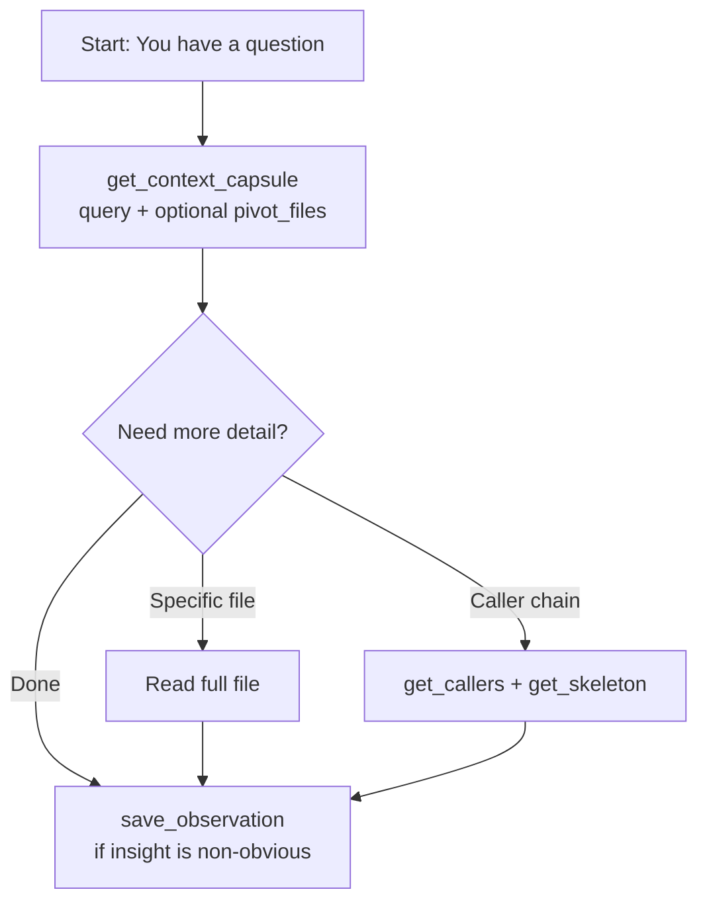
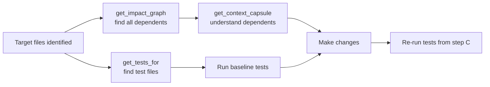
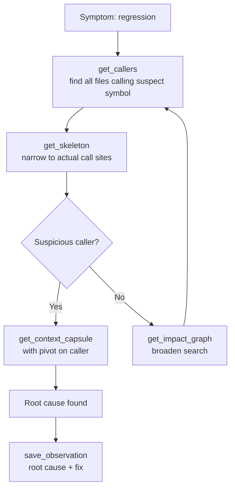
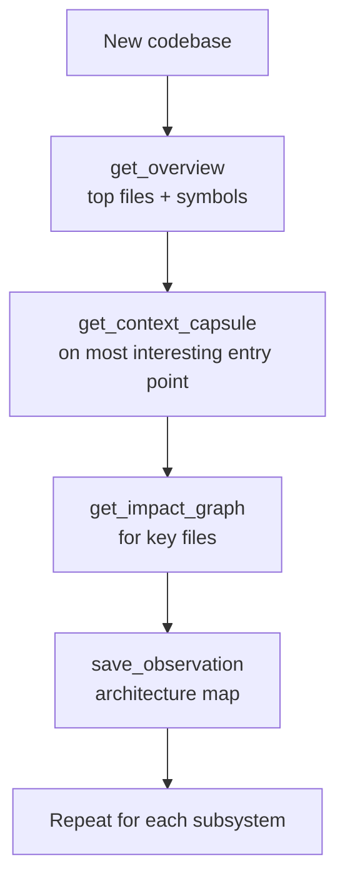
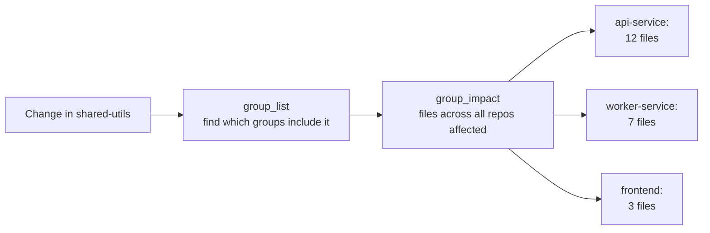
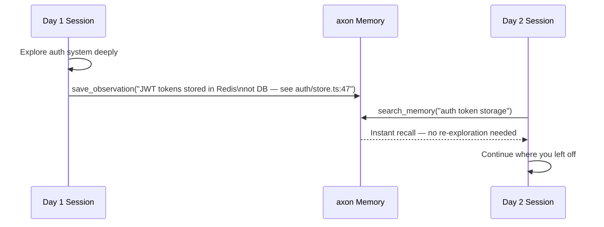

# Agentic Workflow Patterns

This document describes canonical workflows for using axon with Claude Code. Each workflow includes the context, the recommended tool sequence, and concrete Claude Code prompts you can use.

---

## 1. Semantic Exploration — "I Want to Understand How X Works"

**Context:** You need to understand a feature, subsystem, or data flow without knowing which files are involved.



**Tool sequence:**

```
get_context_capsule(query="<your question>")
  → read pivot files if more detail is needed
  → save_observation(content="<mental map>", tags=["overview", "<feature>"])
```

**Step-by-step in Claude Code:**

1. **Ask the question in natural language.** axon selects the pivot files automatically.

   ```
   How does payment processing work in this codebase?
   ```

2. **If the capsule covers it, great.** If you need more depth on a specific file:

   ```
   Show me the full implementation of the PaymentService class.
   ```

3. **Steer the pivot selection if you already know some relevant files.**

   ```
   Explain the payment flow, focusing on src/services/payment.ts and src/api/checkout.ts.
   ```
   *(This triggers `get_context_capsule` with `pivot_files` set.)*

4. **Save your understanding for future sessions.**

   ```
   Save this observation: payment processing goes through PaymentService.charge() → StripeAdapter → webhook confirmation. Refunds follow a separate async queue.
   ```

**Tips:**
- Start broad, then narrow: first understand the feature, then read specific implementations.
- Use a higher token budget for complex multi-file subsystems: ask Claude to use `token_budget=16000`.

---

## 2. Before a Refactor — "I'm About to Change Function Y"

**Context:** You want to change a function, class, or module. Before touching anything, you need to know the blast radius.



**Tool sequence:**

```
get_impact_graph(files=[<files you plan to change>])
  → get_tests_for(files=[<files you plan to change>])
  → get_context_capsule(query="<the change you plan to make>")
  → make changes
  → run the tests returned by get_tests_for
```

**Step-by-step in Claude Code:**

1. **Map the blast radius first.**

   ```
   Before I change src/auth/middleware.ts, show me every file that depends on it.
   ```

2. **Find the tests to run.**

   ```
   Which tests cover src/auth/middleware.ts?
   ```

3. **Get context for the change.**

   ```
   I'm going to extract the rate limiting logic from src/auth/middleware.ts into its own module. Give me context for that refactor.
   ```

4. **Make the changes.** Write-through indexing updates the graph automatically.

5. **Run the tests that were identified.**

   ```
   Run the test files you identified for src/auth/middleware.ts.
   ```

**Tips:**
- If `get_impact_graph` returns a very large set of files, consider whether your change is too broad. Narrow the scope.
- For a rename specifically, use `rename` with `dry_run=true` first to preview the impact.

---

## 3. Debugging a Regression — "Function Z Is Returning Wrong Results"

**Context:** A function is misbehaving. You need to find every call site and trace the data flow.



**Tool sequence:**

```
get_callers(symbol_name="<broken function>")
  → get_skeleton(files=[caller files])     ← narrow to real call sites
  → get_context_capsule(query="<bug hypothesis>", pivot_files=[most suspicious callers])
  → save_observation(content="root cause: ...", tags=["bug", "<module>"])
```

**Step-by-step in Claude Code:**

1. **Find all call sites.**

   ```
   Which files call the calculateDiscount function?
   ```

2. **Narrow to call sites without reading full file bodies.**

   ```
   Show me the signatures of the files that call calculateDiscount.
   ```

3. **Get deep context on the most suspicious callers.**

   ```
   I think the bug is in how the checkout flow calls calculateDiscount. Give me context focused on src/checkout/order.ts and src/checkout/cart.ts.
   ```

4. **After finding the root cause, save it.**

   ```
   Save this: calculateDiscount applies stackable coupons before checking exclusivity rules. When two exclusive coupons are stacked, the second one's discount is applied even though it should be rejected. Fix: check exclusivity before applying any coupon.
   Tags: bug, checkout, discount
   ```

**Tips:**
- `get_callers` is file-granular. Follow up with `get_skeleton` to find the exact line.
- If the function has a common name that appears in multiple files, disambiguate: "Which files call `validateToken` in `src/auth/token.ts`?"

---

## 4. Onboarding a New Codebase — "I Just Cloned This Project"

**Context:** You are starting fresh on an unfamiliar codebase and need to orient yourself before any productive work.



**Tool sequence:**

```
get_overview(limit=10)
  → pick files/symbols of interest
  → get_context_capsule(query="<derived question from overview>")
  → get_skeleton(files=[top coupled files])   ← understand the API surface
  → save_observation(content="<project mental map>", tags=["overview", "<project-name>"])
```

**Step-by-step in Claude Code:**

1. **Start with the overview — the project's nervous center.**

   ```
   Give me an overview of this codebase. What are the most important files and symbols?
   ```

2. **Dive into a file that looks central.**

   ```
   Show me the public API of the most coupled file (without implementations).
   ```

3. **Ask about the overall architecture.**

   ```
   Based on the overview, explain how the main data flows through this project.
   ```

4. **Explore a specific subsystem you'll be working on.**

   ```
   I'll be working on the authentication system. Give me a context capsule for how auth works.
   ```

5. **Save your mental map.**

   ```
   Save this overview: this is an Express API with a service layer (src/services/), data access via repositories (src/repos/), and middleware in src/middleware/. Auth goes through JwtMiddleware → UserService → UserRepository. Entry point is src/server.ts.
   Tags: overview, architecture
   ```

**Tips:**
- `get_overview` gives you the map; `get_context_capsule` fills in the territory.
- Save the mental map immediately — it will be available in future sessions via `search_memory`.

---

## 5. API Endpoint Change — "I Need to Modify the /users Endpoint"

**Context:** You need to change a specific HTTP endpoint and want to understand the full impact.

**Tool sequence:**

```
route_map()                               ← find the handler
  → api_impact(route_path="/users/:id")  ← full blast radius
  → get_context_capsule(query="<what you need to change>", pivot_files=[handler file])
  → make changes
  → get_tests_for(files=[handler and service files])
```

**Step-by-step in Claude Code:**

1. **List all routes to find the one you need.**

   ```
   Show me all the API routes in this project.
   ```

2. **Get the full blast radius for the target endpoint.**

   ```
   What is the full impact graph for the /api/users/:id endpoint?
   ```

3. **Get context for your specific change.**

   ```
   I need to add pagination to the GET /api/users endpoint. Give me context for that change.
   ```

4. **Make the changes.**

5. **Find and run the relevant tests.**

   ```
   Which tests cover the users endpoint handler and its service?
   ```

**Tips:**
- Use `route_map` first even if you think you know the handler file — the actual handler might differ from where the route is registered.
- `api_impact` often reveals service and repository layers you might not think to check.

---

## 6. Multi-Repo Blast Radius — "I Changed a Shared Utility"

**Context:** You changed a file in a shared library or package that other repos in your registry depend on.



**Tool sequence:**

```
group_list()                                ← confirm which repos are registered
  → group_impact(file="<changed file>")    ← find cross-repo dependents
  → index each affected repo if stale
  → get_tests_for in each affected repo
```

**Step-by-step in Claude Code:**

1. **Verify your registry.**

   ```
   List all repos registered in my axon registry.
   ```

2. **Find cross-repo impact.**

   ```
   I changed packages/shared/event-types.ts. Which other registered repos depend on it?
   ```

3. **For each affected repo, find the dependent files.**

   ```
   In the payments-service repo, show me which files import from event-types.ts.
   ```

4. **Find tests in the affected repos.**

   ```
   Which tests in payments-service cover the files that use event-types.ts?
   ```

**Tips:**
- All repos must be indexed individually before they appear in the registry. Run `axon index` in each repo root.
- Use `axon serve --http --all` to expose a single HTTP endpoint aggregating all registered repos for browser-based inspection.

---

## 7. Cross-Session Memory — "Resuming Work on This Codebase"

**Context:** You are returning to a project after a break. Previous sessions may have saved findings, root causes, and architectural notes.



**Tool sequence:**

```
search_memory(query="<area you're working on>")
  → read relevant observations
  → get_context_capsule(query="<current task>")   ← fresh context for today's work
```

**Step-by-step in Claude Code:**

1. **Recall what was learned previously.**

   ```
   What do we know about the authentication system from previous sessions?
   ```

2. **Search for specific topics.**

   ```
   Search memory for anything related to rate limiting bugs.
   ```

3. **Get fresh context for today's task.**

   ```
   I'm continuing work on the payment refund flow. Give me context for that.
   ```

4. **Save today's findings before ending the session.**

   ```
   Save this: the refund processor uses an async queue (BullMQ) and retries up to 3 times with exponential backoff. Failed refunds after 3 attempts go to the dead-letter queue at src/queues/dlq.ts. Tags: payments, refunds, queue.
   ```

**Tips:**
- Make saving observations a habit at the end of every session. It costs almost nothing and pays dividends in every future session.
- Tags make future retrieval much more precise. Use consistent tags: module names, bug/feature/gotcha, PR numbers.

---

## 8. Graph-Safe Rename — "Rename authenticateUser to verifyToken"

**Context:** A function or class needs to be renamed across the entire codebase. Manual find-and-replace risks missing aliased imports, re-exports, and dynamic references.

**Tool sequence:**

```
rename(symbol_name="authenticateUser", new_name="verifyToken", dry_run=true)
  → review the list of affected files
  → rename(symbol_name="authenticateUser", new_name="verifyToken")  ← apply
  → get_tests_for(files=[files modified by rename])
  → run tests
```

**Step-by-step in Claude Code:**

1. **Preview the rename without writing changes.**

   ```
   Preview renaming authenticateUser to verifyToken — show me all affected files but don't change anything yet.
   ```

2. **Review the list.** If it looks correct, apply.

   ```
   Apply the rename: authenticateUser → verifyToken.
   ```

3. **Find the tests to run.**

   ```
   Which tests cover the files that were just modified?
   ```

4. **Run the tests to confirm no breakage.**

**Tips:**
- Always use `dry_run=true` first. The preview is fast and free.
- If the symbol name is common (e.g., `validate`), use the `file_path` parameter to disambiguate: "Rename `validate` in `src/auth/validator.ts` to `validateAuthToken`."
- After renaming, the write-through hook updates the index automatically — no manual `axon index` needed.

---

## Workflow Quick Reference

| Situation | Start with | Then |
|-----------|-----------|------|
| Understand a feature | `get_context_capsule` | `save_observation` |
| Before a refactor | `get_impact_graph` | `get_tests_for` |
| Debugging | `get_callers` | `get_skeleton` → `get_context_capsule` |
| New codebase | `get_overview` | `get_context_capsule` |
| API endpoint change | `route_map` | `api_impact` → `get_context_capsule` |
| Multi-repo change | `group_list` | `group_impact` |
| Resuming work | `search_memory` | `get_context_capsule` |
| Rename | `rename` (dry run) | `rename` (apply) → `get_tests_for` |
