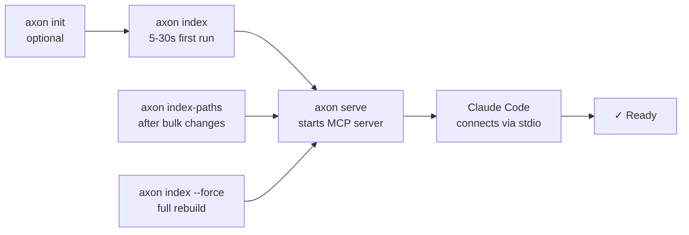
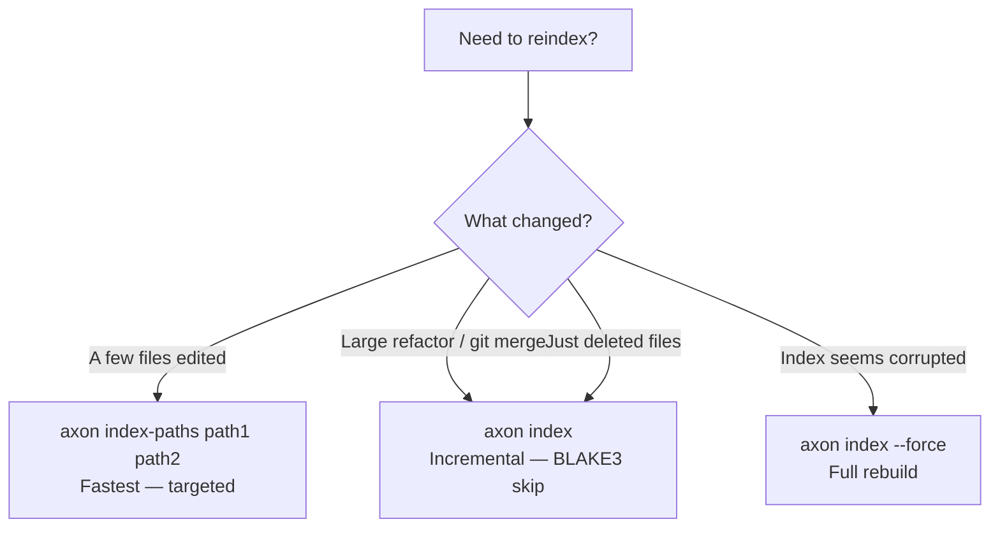
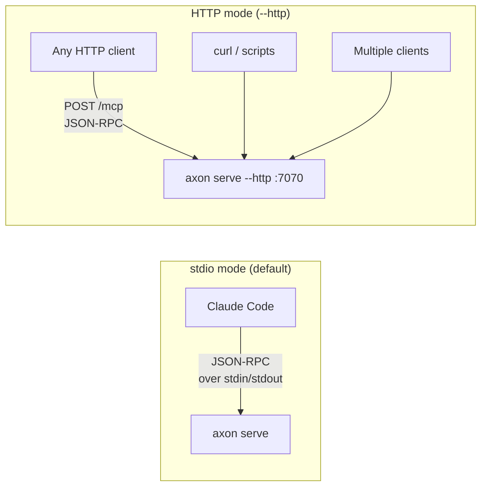
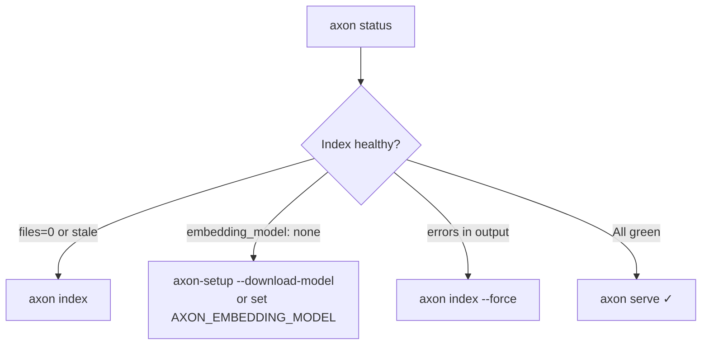

# Referência CLI

Referência completa de todos os comandos `axon` via linha de comando. Cada comando opera no projeto no diretório atual, a menos que um argumento `[path]` seja fornecido.

---

## Flags Globais

| Flag | Descrição |
|------|-----------|
| `--version`, `-V` | Exibe número de versão e SHA do build e encerra. |
| `--help`, `-h` | Exibe resumo de uso e encerra. |

---

## Fluxo do Caminho Feliz



---

## Comandos

### `axon init`

Inicializa um `.axon/config.toml` com valores padrão na raiz do projeto.

**Sintaxe**

```
axon init [path]
```

**Argumentos**

| Argumento | Obrigatório | Descrição |
|-----------|-------------|-----------|
| `path` | Não | Diretório do projeto alvo. Padrão: diretório de trabalho atual. |

**Descrição**

Cria `.axon/config.toml` no caminho especificado (ou cwd) com configurações padrão. Se o arquivo já existir, o comando encerra sem modificá-lo — é seguro executar repetidamente.

Execute `axon init` antes de `axon index` se quiser personalizar a configuração antes da primeira indexação (por exemplo, definir `granularity = "symbol"` antes do parse inicial).

**Exemplos**

```bash
# Inicializar no diretório atual
axon init

# Inicializar em um projeto específico
axon init /caminho/para/seu-projeto
```

---

### `axon index`

Parseia todos os arquivos de código, constrói o grafo de dependências e computa embeddings.

**Sintaxe**

```
axon index [path] [--force]
```

**Argumentos**

| Argumento | Obrigatório | Descrição |
|-----------|-------------|-----------|
| `path` | Não | Diretório do projeto a indexar. Padrão: cwd. |

**Flags**

| Flag | Descrição |
|------|-----------|
| `--force` | Re-resolve arestas e símbolos mesmo quando o hash do arquivo não mudou. Use após alterar `granularity` no `.axon/config.toml`. |

**Descrição**

Realiza uma indexação completa do projeto:
1. Percorre o diretório (respeitando `.axonignore` e `.gitignore`).
2. Parseia cada arquivo com grammars tree-sitter para extrair símbolos e arestas de importação.
3. Resolve caminhos de importação para caminhos canônicos e escreve o grafo de dependências em `.axon/index.duckdb`.
4. Computa embeddings vetoriais para cada arquivo/símbolo se `AXON_EMBEDDING_MODEL` estiver configurado.

Hashes de arquivo são rastreados — arquivos não modificados são pulados, a menos que `--force` seja usado. Para atualizações incrementais após editar arquivos específicos, prefira `axon index-paths`, que é significativamente mais rápido.

O projeto é automaticamente registrado em `~/.axon/registry.json` após uma indexação bem-sucedida.

**Exemplos**

```bash
# Indexar o projeto atual
axon index

# Indexar um caminho de projeto específico
axon index /caminho/para/seu-projeto

# Forçar re-resolução de todas as arestas (necessário após alterar granularity na config)
axon index --force
```

**Observações**

- A primeira indexação de um projeto grande (500k+ linhas) pode levar alguns minutos. Reindexações incrementais subsequentes são rápidas.
- Durante o uso normal no Claude Code, o hook write-through (`axon-post-edit.sh`) chama `axon index-paths` automaticamente após cada edição de arquivo. O `axon index` manual raramente é necessário.

#### Árvore de Decisão de Reindexação



---

### `axon index-paths`

Reindexação incremental de arquivos específicos. Muito mais rápido do que uma reindexação completa.

**Sintaxe**

```
axon index-paths <arquivos...> [--prune]
```

**Argumentos**

| Argumento | Obrigatório | Descrição |
|-----------|-------------|-----------|
| `arquivos...` | Sim (exceto `--prune` isolado) | Um ou mais caminhos de arquivo a reindexar. Podem ser absolutos ou relativos à raiz do projeto. |

**Flags**

| Flag | Descrição |
|------|-----------|
| `--prune` | Remove arquivos deletados do índice. Pode ser usado sozinho (sem arquivos) após deleções. |

**Descrição**

Re-parseia e re-embeda apenas os arquivos especificados, depois atualiza as arestas do grafo de dependências para esses arquivos. Todos os outros arquivos permanecem inalterados no índice.

Use `--prune` após deletar ou renomear arquivos para remover entradas obsoletas do índice DuckDB sem reprocessar o projeto inteiro.

**Exemplos**

```bash
# Reindexar dois arquivos específicos
axon index-paths src/auth.ts src/utils.ts

# Reindexar um único arquivo
axon index-paths src/api/routes/users.ts

# Remover arquivos deletados sem reindexar
axon index-paths --prune

# Reindexar e remover obsoletos em uma passagem
axon index-paths src/novo-modulo.ts --prune
```

---

### `axon serve`

Inicia o servidor MCP (modo stdio JSON-RPC 2.0) ou um servidor HTTP REST API.

**Sintaxe**

```
axon serve [--http] [--port=N] [--host=ADDR] [--group=NOME] [--all]
```

**Flags**

| Flag | Padrão | Descrição |
|------|--------|-----------|
| `--http` | off | Muda para modo HTTP REST API em vez de stdio MCP. |
| `--port=N` | `7070` | Número de porta para modo HTTP. |
| `--host=ADDR` | `127.0.0.1` | Endereço de bind para modo HTTP. |
| `--all` | off | Agrega todos os repos registrados em `~/.axon/registry.json` (apenas modo HTTP). |
| `--group=NOME` | — | Agrega apenas repos no grupo nomeado do registry (apenas modo HTTP). |

**Descrição**

Sem `--http`: inicia um servidor MCP stdio ao qual o Claude Code se conecta via o processo configurado em `~/.claude.json`. O servidor responde a requisições JSON-RPC 2.0 do Claude Code e despacha para as 15 ferramentas MCP.

Com `--http`: inicia um servidor HTTP REST API. Útil para UIs em browser, integrações externas ou testes via `curl`. Veja `docs/pt-br/configuration.md` para os endpoints REST disponíveis.

**Exemplos**

```bash
# Iniciar servidor MCP stdio (modo padrão do Claude Code)
axon serve

# Iniciar servidor HTTP na porta padrão 7070
axon serve --http

# Iniciar servidor HTTP em porta personalizada
axon serve --http --port=8080

# Servir todos os repos registrados em modo agregado (apenas HTTP)
axon serve --http --all

# Servir apenas o grupo "backend" (apenas HTTP)
axon serve --http --group=backend

# Bind em todas as interfaces (para acesso remoto — use com cuidado)
axon serve --http --host=0.0.0.0 --port=7070
```

**Observações**

- No modo stdio, o Claude Code gerencia o ciclo de vida do processo. Não é necessário manter um terminal aberto.
- No modo HTTP, o servidor roda em primeiro plano. Use um gerenciador de processos (systemd, launchd, `screen`) para operação persistente.
- `--all` e `--group` são significativos apenas no modo HTTP.

#### Comparação dos Modos de Serve



---

### `axon capsule`

Imprime uma capsule de contexto para uma query no stdout.

**Sintaxe**

```
axon capsule <query> [--no-cache]
```

**Argumentos**

| Argumento | Obrigatório | Descrição |
|-----------|-------------|-----------|
| `query` | Sim | Query em linguagem natural descrevendo o contexto necessário. |

**Flags**

| Flag | Descrição |
|------|-----------|
| `--no-cache` | Ignora o cache por hash de query e força recomputação. |

**Descrição**

Monta e imprime a mesma capsule de contexto que `get_context_capsule` retornaria dentro do Claude Code. Útil para scripts, pipelines de CI ou depuração do output da capsule fora de uma sessão interativa.

O output é texto simples (o mesmo formato entregue ao Claude Code como resposta da ferramenta MCP).

**Exemplos**

```bash
# Testar uma capsule para uma query
axon capsule "como funciona a autenticação"

# Ignorar cache e forçar recomputação
axon capsule "entry point do indexador" --no-cache

# Passar para paginador para output longo
axon capsule "gerenciamento de conexão com banco de dados" | less

# Salvar capsule em arquivo
axon capsule "fluxo de pagamento" > contexto-pagamento.txt
```

---

### `axon skeleton`

Imprime uma visão apenas de assinaturas de um arquivo.

**Sintaxe**

```
axon skeleton <arquivo>
```

**Argumentos**

| Argumento | Obrigatório | Descrição |
|-----------|-------------|-----------|
| `arquivo` | Sim | Caminho para o arquivo fonte. Relativo à raiz do projeto ou absoluto. |

**Descrição**

Exibe os símbolos do arquivo (funções, classes, métodos, interfaces, tipos) com suas assinaturas e docstrings — mas sem corpos de função. Equivalente a chamar a ferramenta MCP `get_skeleton` em um único arquivo.

Útil para entender rapidamente a API pública de um módulo sem ler a implementação completa.

**Exemplos**

```bash
# Mostrar assinaturas de um arquivo TypeScript
axon skeleton src/auth/token.ts

# Mostrar assinaturas de um módulo Python
axon skeleton app/services/payment.py

# Salvar em arquivo para inspeção
axon skeleton src/api/router.ts > api-do-router.txt
```

---

### `axon status`

Exibe estatísticas do índice e informações de saúde.

**Sintaxe**

```
axon status
```

**Descrição**

Imprime um resumo do índice atual:

- Número de arquivos indexados
- Número de símbolos extraídos
- Número de arestas de dependência
- Número de observações salvas
- Contagem de cache hits para a sessão atual do servidor
- Idade do índice (tempo desde a última indexação completa)
- Status do modelo de embeddings (carregado / não configurado)

Use para verificar que o índice está fresco e o modelo disponível antes de iniciar uma sessão no Claude Code.

**Exemplo**

```bash
axon status
```

Exemplo de saída:

```
axon index status
  Project : /home/user/meu-projeto
  Files   : 312
  Symbols : 4.871
  Edges   : 9.204
  Obs.    : 14 observations saved
  Age     : 3 hours ago
  Model   : nomic-embed-text-v1.5 (loaded)
  Cache   : 127 hits
```

#### Fluxo de Diagnóstico



---

### `axon help`

Exibe um resumo de uso de todos os comandos disponíveis.

**Sintaxe**

```
axon help
```

---

### `axon --version`

Imprime o número de versão e o SHA git do build.

**Sintaxe**

```
axon --version
axon -V
```

**Exemplo**

```bash
axon --version
# → axon 0.5.5 (build a0db696)
```

---

## Variáveis de Ambiente

As variáveis de ambiente que afetam o comportamento da CLI estão documentadas na referência de [Configuração](configuration.md).

## Códigos de Saída

| Código | Significado |
|--------|-------------|
| `0` | Sucesso |
| `1` | Erro geral (argumento ausente, arquivo não encontrado, etc.) |
| `2` | Índice não encontrado — execute `axon index` primeiro |
| `3` | Erro no modelo de embeddings (caminho inválido, formato não suportado) |
