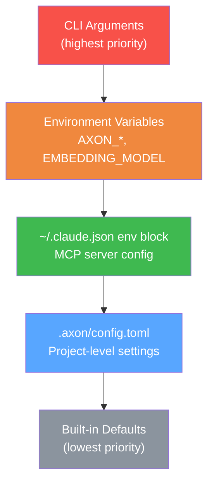
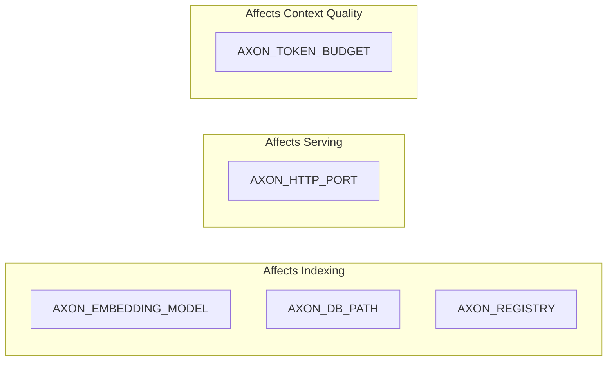
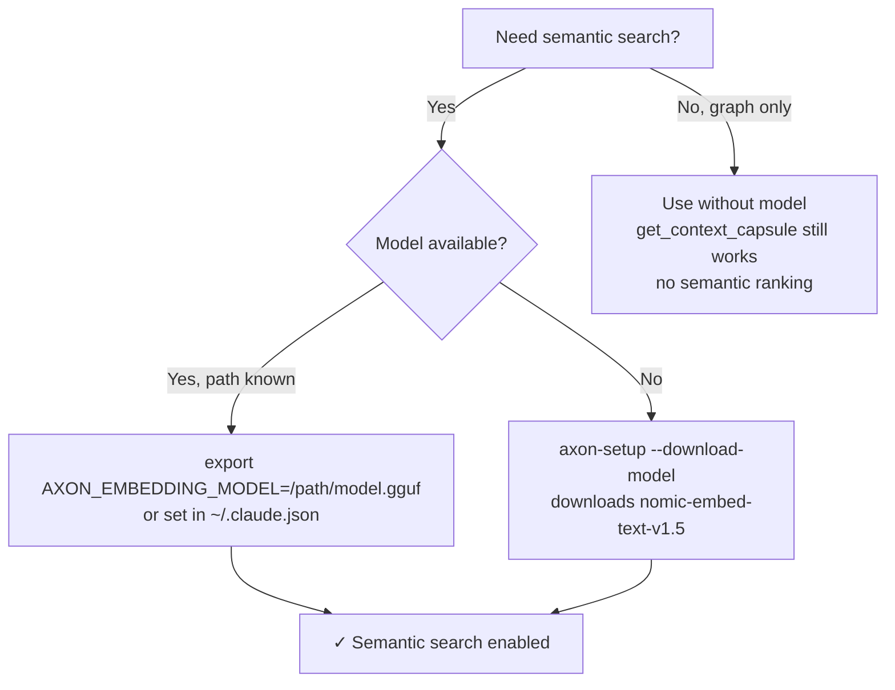
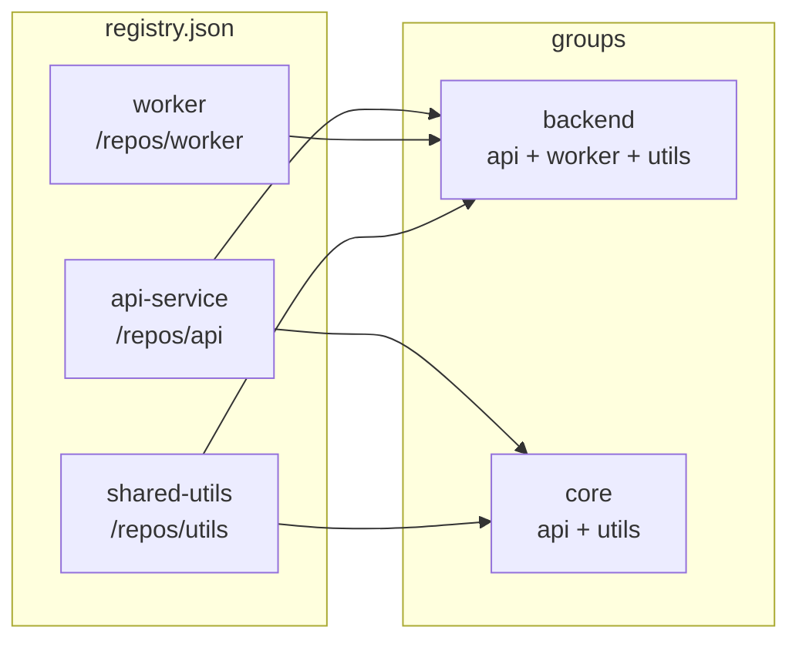

# Referência de Configuração

O axon é configurado por três mecanismos: um arquivo TOML por projeto, variáveis de ambiente e o registro MCP do Claude Code em `~/.claude.json`. Um quarto arquivo opcional, `.axonignore`, controla quais arquivos são excluídos da indexação.




---

## Configuração por Projeto — `.axon/config.toml`

Criado automaticamente pelo `axon init` ou `axon index` na raiz do projeto. Edite manualmente para personalizar o comportamento de indexação.

### `granularity`

Controla a profundidade do grafo de dependências.

```toml
# .axon/config.toml

granularity = "symbol"   # "file" (padrão) ou "symbol"
```

| Valor | Descrição |
|-------|-----------|
| `"file"` | **(Padrão)** Grafo em nível de importação. Arestas conectam arquivos aos arquivos que eles importam. Rápido e suficiente para a maioria dos projetos. |
| `"symbol"` | Grafo em nível de chamada. Arestas conectam funções e classes individuais aos símbolos específicos que elas chamam ou estendem. Permite BFS mais granular em `get_impact_graph` e `get_callers`. Mais lento para indexar, mas mais preciso. |

**Quando usar `"symbol"`:**
- Projetos grandes onde o blast radius em nível de arquivo é muito amplo.
- Quando os resultados de `get_callers` precisam ser afunilados a call sites específicos.
- Microsserviços com fronteiras de módulo bem definidas.

**Importante:** Após alterar `granularity`, é necessário re-resolver todo o grafo:

```bash
axon index --force
```

Sem `--force`, hashes de arquivo não modificados são pulados e o grafo ficará inconsistente.

---

## Variáveis de Ambiente



Configure em seu perfil de shell (`~/.bashrc`, `~/.zshrc`) ou no bloco `env` do `~/.claude.json`.

### `AXON_EMBEDDING_MODEL`

```
AXON_EMBEDDING_MODEL=/caminho/para/nomic-embed-text-v1.5.Q4_K_M.gguf
```

**Necessária para:**
- `search_memory` — busca semântica sobre observações salvas.
- Modo de query semântica do `get_context_capsule` — seleção de pivôs de maior qualidade por similaridade vetorial.

**Sem esta variável:**
- Todas as 15 ferramentas funcionam normalmente.
- `get_context_capsule` usa apenas seleção de pivôs por centralidade de grafo como fallback.
- `search_memory` retorna resultados vazios.

**Modelo recomendado:** `nomic-embed-text-v1.5.Q4_K_M.gguf` (~80 MB). Baixe via:

```bash
axon-setup --download-model /caminho/para/seu-projeto
```

Ou defina `AXON_DOWNLOAD_MODEL=1` para baixar automaticamente durante o setup (veja abaixo).



---

### `AXON_TOKEN_BUDGET`

```
AXON_TOKEN_BUDGET=8192
```

Orçamento de tokens padrão para capsules de contexto. Este é o número máximo de tokens que o axon incluirá em uma única resposta do `get_context_capsule`.

Pode ser sobrescrito por chamada via o parâmetro `token_budget`.

**Valores típicos:**
- `4096` — orçamento apertado, respostas rápidas, pode omitir alguns arquivos de suporte.
- `8192` — **(padrão)** balanceado; funciona bem para a maioria das queries.
- `16384` — orçamento amplo para queries multi-arquivo complexas; aumenta o custo da API Claude proporcionalmente.

---

### `AXON_TELEMETRY`

```
AXON_TELEMETRY=0
```

| Valor | Comportamento |
|-------|---------------|
| `0` | **(Padrão)** Telemetria desabilitada. |
| `1` | Opt-in de telemetria. Atualmente sem efeito — o design do endpoint de telemetria está em andamento. Nenhum dado é enviado nesta versão. |

---

### `AXON_DOWNLOAD_MODEL`

```
AXON_DOWNLOAD_MODEL=1
```

Quando definido como `1`, o `axon-setup` baixa o modelo de embeddings automaticamente sem exibir um prompt interativo. Útil para ambientes de CI ou scripts de provisionamento automatizado.

---

### `AXON_MODEL_DIR`

```
AXON_MODEL_DIR=/caminho/para/modelos
```

Diretório onde o `axon-setup --download-model` salva o arquivo do modelo de embeddings.

**Padrão:** `<install-dir>/models/` (relativo ao local do binário axon).

---

### `AXON_DB_PATH`

Caminho para o arquivo de índice DuckDB. Padrão: `.axon/index.duckdb` relativo à raiz do projeto.

```bash
export AXON_DB_PATH=/shared/indexes/meu-projeto.duckdb
```

Útil para armazenar índices em volume separado ou compartilhar entre diretórios.

---

### `AXON_REGISTRY`

Caminho para o arquivo de registro multi-repositório. Quando definido, o axon carrega grupos cross-repo, habilitando as ferramentas `group_list` e `group_impact`.

```bash
export AXON_REGISTRY=/opt/projects/registry.json
```

---

### `AXON_HTTP_PORT`

Porta para o modo HTTP (`axon serve --http`). Padrão: `7070`.

```bash
export AXON_HTTP_PORT=8080
axon serve --http
```

---

## Configuração MCP do Claude Code — `~/.claude.json`

Registre o axon como servidor MCP do Claude Code para que o Claude possa chamar as 15 ferramentas automaticamente.

### Configuração mínima (sem modelo de embeddings)

```json
{
  "mcpServers": {
    "axon": {
      "command": "axon",
      "args": ["serve"]
    }
  }
}
```

### Com modelo de embeddings

```json
{
  "mcpServers": {
    "axon": {
      "command": "axon",
      "args": ["serve"],
      "env": {
        "AXON_EMBEDDING_MODEL": "/caminho/para/nomic-embed-text-v1.5.Q4_K_M.gguf"
      }
    }
  }
}
```

### Com configuração completa de ambiente

```json
{
  "mcpServers": {
    "axon": {
      "command": "axon",
      "args": ["serve"],
      "env": {
        "AXON_EMBEDDING_MODEL": "/home/user/models/nomic-embed-text-v1.5.Q4_K_M.gguf",
        "AXON_TOKEN_BUDGET": "12000"
      }
    }
  }
}
```

### Para instalações via download direto (binário não está no PATH)

Se você instalou via tarball e o binário não está no PATH do sistema, use o caminho completo:

```json
{
  "mcpServers": {
    "axon": {
      "command": "/usr/local/bin/axon",
      "args": ["serve"],
      "env": {
        "AXON_EMBEDDING_MODEL": "/caminho/para/nomic-embed-text-v1.5.Q4_K_M.gguf"
      }
    }
  }
}
```

**Após qualquer alteração no `~/.claude.json`, reinicie o Claude Code para que a nova configuração entre em vigor.**

---

## Registry Multi-Repositório — `~/.axon/registry.json`

O axon mantém um registry global de projetos indexados. É auto-populado toda vez que você executa `axon index` em um projeto. Raramente é necessário editá-lo manualmente, mas o formato está documentado aqui para uso avançado.

### Auto-registro

Executar `axon index /caminho/para/projeto` adiciona ou atualiza automaticamente uma entrada em `~/.axon/registry.json`. Nenhuma ação manual é necessária.

### Formato manual

```json
{
  "repos": [
    {
      "name": "minha-api",
      "root": "/caminho/para/minha-api",
      "db_path": "/caminho/para/minha-api/.axon/index.duckdb"
    },
    {
      "name": "shared-lib",
      "root": "/caminho/para/shared-lib",
      "db_path": "/caminho/para/shared-lib/.axon/index.duckdb"
    },
    {
      "name": "frontend",
      "root": "/caminho/para/frontend",
      "db_path": "/caminho/para/frontend/.axon/index.duckdb"
    }
  ],
  "groups": {
    "backend": ["minha-api", "shared-lib"],
    "todos-servicos": ["minha-api", "shared-lib", "frontend"]
  }
}
```



**Campos:**

| Campo | Descrição |
|-------|-----------|
| `repos[].name` | Nome de exibição usado por `group_list` e pela flag `--group=NOME`. |
| `repos[].root` | Caminho absoluto para a raiz do projeto. |
| `repos[].db_path` | Caminho absoluto para o arquivo DuckDB de índice do projeto. |
| `groups` | Coleções nomeadas de nomes de repos. Usadas com `axon serve --group=NOME` e `group_impact`. |

### Comandos de grupo (forma abreviada)

Em vez de editar JSON manualmente, use a CLI:

```bash
# Registrar repos em um grupo nomeado
axon group add backend /caminho/para/minha-api /caminho/para/shared-lib

# Iniciar servidor HTTP para um grupo
axon serve --http --group=backend
```

---

## `.axonignore` — Excluindo Arquivos da Indexação

Coloque um arquivo `.axonignore` na raiz do projeto para excluir arquivos e diretórios da indexação. O formato segue a sintaxe do gitignore.

```gitignore
# Excluir output de build e dependências
node_modules/
dist/
build/
.next/
target/

# Excluir arquivos gerados
**/*.generated.ts
**/*.pb.go

# Excluir fixtures de teste (mas ainda indexar os arquivos de teste em si)
tests/fixtures/
__fixtures__/

# Negação: re-incluir um arquivo específico que seria excluído
!src/generated/schema-importante.ts

# Padrões ancorados (relativos à raiz do projeto)
/vendor/
/third_party/

# Excluir por extensão
*.min.js
*.bundle.js
```

**Regras de sintaxe (igual ao `.gitignore`):**

| Padrão | Efeito |
|--------|--------|
| `node_modules/` | Excluir diretório por nome, em qualquer lugar da árvore |
| `/vendor/` | Excluir apenas na raiz do projeto |
| `**/*.generated.ts` | Excluir todos os arquivos `.generated.ts` recursivamente |
| `!src/importante.ts` | Re-incluir um arquivo que correspondeu a uma exclusão anterior |
| `*.min.js` | Excluir todos os arquivos `.min.js` |
| `# comentário` | Linha de comentário, ignorada |

**Nota:** O axon também respeita `.gitignore` automaticamente. Você só precisa do `.axonignore` para padrões que devem ser excluídos da indexação, mas não do rastreamento git (ex.: grandes assets binários ou código vendorizado de terceiros que é rastreado no git, mas irrelevante para contexto).
