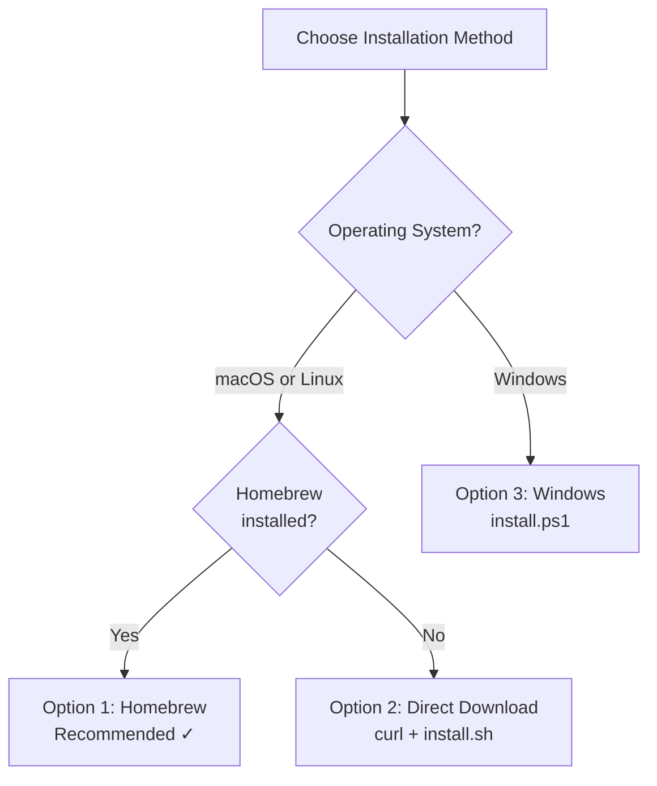
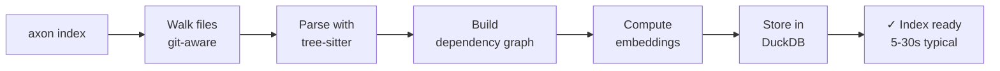
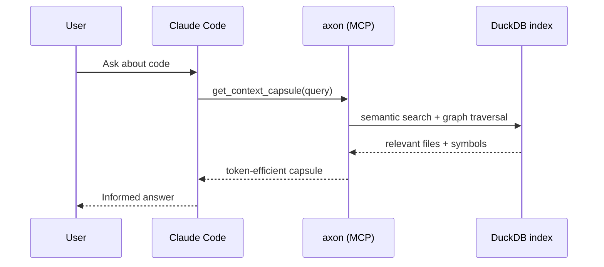

# Introdução ao axon

**axon** é um servidor MCP (Model Context Protocol) local que fornece contexto cirúrgico para agentes de IA que trabalham com código — montando cápsulas com orçamento de tokens a partir do seu projeto em vez de despejar arquivos brutos na janela de contexto.

Este guia leva você do zero até a primeira query `get_context_capsule` no Claude Code.

---

## Pré-requisitos

| Requisito | Observações |
|-----------|-------------|
| **jq** | Necessário pelo `axon-setup` para manipulação de JSON. Instale com `brew install jq` (macOS) ou `apt install jq` (Debian/Ubuntu). |
| **git** | Necessário para `detect_changes` e registro de repositórios. Geralmente já instalado. |
| **Sem ferramentas de build** | Não necessário | O axon é distribuído como binário pré-compilado — nenhum compilador necessário. |

---

## Instalação




### Opção 1 — Homebrew (recomendado para macOS e Linux)

```bash
brew tap HideakiSolutions/axon
brew install axon
```

Após a instalação, execute o assistente de configuração para indexar seu projeto, baixar opcionalmente o modelo de embeddings e registrar o axon no Claude Code automaticamente:

```bash
axon-setup /caminho/para/seu-projeto
```

Pronto. Pule para [Primeiro Índice](#primeiro-índice) se quiser entender o que o `axon-setup` faz por baixo dos panos, ou vá direto para [Configurar o Claude Code](#configurar-o-claude-code-manualmente) se precisar de controle manual.

---

### Opção 2 — Download Direto (Linux / macOS tarball)

1. Encontre a versão mais recente em [GitHub Releases](https://github.com/HideakiSolutions/axon-releases/releases/latest).

2. Baixe e extraia:

```bash
VERSION=0.5.5

# Linux x86-64
curl -L -o axon.tar.gz \
  "https://github.com/HideakiSolutions/axon-releases/releases/download/v${VERSION}/axon-${VERSION}-linux-x64.tar.gz"

# macOS Apple Silicon
# curl -L -o axon.tar.gz \
#   "https://github.com/HideakiSolutions/axon-releases/releases/download/v${VERSION}/axon-${VERSION}-macos-arm64.tar.gz"

tar xzf axon.tar.gz
cd "axon-${VERSION}-linux-x64"
```

3. Execute o instalador:

```bash
./install.sh /caminho/para/seu-projeto
```

O `install.sh` copia o binário para um local no PATH, indexa o projeto e configura o `~/.claude.json` do Claude Code.

---

### Opção 3 — Windows x64

```powershell
$VERSION = "0.5.5"
Invoke-WebRequest `
  "https://github.com/HideakiSolutions/axon-releases/releases/download/v$VERSION/axon-$VERSION-windows-x64.zip" `
  -OutFile "axon.zip"
Expand-Archive axon.zip -DestinationPath "axon-$VERSION-windows-x64"
cd "axon-$VERSION-windows-x64"
.\install.ps1 C:\caminho\para\seu-projeto
```

Para adicionar `axon.exe` ao PATH na sessão atual:

```powershell
$env:PATH += ";$(Resolve-Path bin)"
```

---

## Primeiro Índice

Seja usando o `axon-setup` ou tendo instalado manualmente, indexar um projeto usa o mesmo comando:

```bash
axon index /caminho/para/seu-projeto
```

O axon irá:
1. Percorrer todos os arquivos de código no diretório (respeitando `.axonignore` e `.gitignore`).
2. Parsear cada arquivo com grammars tree-sitter para extrair símbolos e arestas.
3. Construir o grafo de dependências e armazená-lo em `.axon/index.duckdb` na raiz do projeto.
4. Opcionalmente computar embeddings para busca semântica (se `AXON_EMBEDDING_MODEL` estiver configurado).

Indexar um projeto de tamanho médio (10k–50k linhas) tipicamente leva 5–30 segundos. Monorepos grandes com mais de 500k linhas podem levar alguns minutos na primeira indexação; reindexações incrementais são muito mais rápidas.



---

## Verificar Status

Após indexar, verifique se o índice está saudável:

```bash
axon status
```

Exemplo de saída:

```
axon index status
  Project : /caminho/para/seu-projeto
  Files   : 312
  Symbols : 4.871
  Edges   : 9.204
  Obs.    : 0 observations saved
  Age     : 2 minutes ago
  Model   : nomic-embed-text-v1.5 (loaded)
  Cache   : 0 hits
```

Se a linha do modelo mostrar `not configured`, a busca semântica utilizará apenas traversal de grafo como fallback — todas as outras ferramentas funcionam normalmente. Veja [Modelo de Embeddings](#opcional-modelo-de-embeddings-para-busca-semântica) abaixo.

---

## Iniciar o Servidor MCP

O Claude Code se comunica com o axon via stdio MCP. Inicie o servidor:

```bash
axon serve
```

O servidor roda em primeiro plano, escutando stdin/stdout para mensagens JSON-RPC 2.0. O Claude Code gerencia o ciclo de vida do processo automaticamente após a configuração — você não precisa iniciar o `axon serve` manualmente a cada sessão.

---

## Configurar o Claude Code Manualmente

Se o `axon-setup` não foi executado (ou se quiser verificar a configuração), adicione o seguinte ao `~/.claude.json`:

```json
{
  "mcpServers": {
    "axon": {
      "command": "axon",
      "args": ["serve"],
      "env": {
        "AXON_EMBEDDING_MODEL": "/caminho/para/nomic-embed-text-v1.5.Q4_K_M.gguf"
      }
    }
  }
}
```



**Observações:**
- Se instalado via Homebrew, `axon` já está no PATH — o campo `command` funciona como está.
- Para instalações via download direto, use o caminho completo do binário: `"command": "/usr/local/bin/axon"`.
- A variável de ambiente `AXON_EMBEDDING_MODEL` é opcional. Omita-a se não tiver o arquivo do modelo.
- Reinicie o Claude Code após modificar o `~/.claude.json`.

---

## Opcional: Modelo de Embeddings para Busca Semântica

O axon suporta um modelo de embeddings local para o modo de query semântica no `get_context_capsule` e para `search_memory`. Sem ele, todas as 15 ferramentas funcionam — o `get_context_capsule` usa apenas traversal de grafo como fallback.

### Baixar o modelo automaticamente

```bash
axon-setup --download-model /caminho/para/seu-projeto
```

### Baixar manualmente

O modelo recomendado é `nomic-embed-text-v1.5.Q4_K_M.gguf` (~80 MB). Após o download, configure a variável de ambiente:

```bash
export AXON_EMBEDDING_MODEL=/caminho/para/nomic-embed-text-v1.5.Q4_K_M.gguf
```

Adicione isso ao seu perfil de shell (`~/.bashrc`, `~/.zshrc`) ou configure no bloco `env` do `~/.claude.json` (veja acima).

---

## Sua Primeira Query no Claude Code

Uma vez que o axon esteja indexado e o servidor MCP configurado, o Claude Code chamará as ferramentas do axon automaticamente sempre que precisar de contexto de código. Você não precisa invocá-las manualmente.

Para acionar sua primeira capsule de contexto, abra uma sessão do Claude Code no seu projeto e pergunte algo como:

```
Como funciona a autenticação nesse projeto?
```

O Claude Code chamará `get_context_capsule(query="como funciona a autenticação")` nos bastidores, receberá uma capsule eficiente em tokens dos arquivos relevantes e responderá com contexto preciso — sem ler cada arquivo.

Você também pode pedir ao Claude Code que execute ferramentas específicas explicitamente:

```
Use get_overview para mostrar os arquivos mais importantes deste projeto.
```

```
Execute get_impact_graph em src/auth/middleware.ts para eu saber o que quebraria se eu alterasse esse arquivo.
```

---

## Próximos Passos

| Tópico | Documento |
|--------|-----------|
| Todos os comandos CLI com flags e exemplos | [Referência CLI](cli-reference.md) |
| Todas as 15 ferramentas MCP com parâmetros e uso | [Ferramentas MCP](mcp-tools.md) |
| Arquivos de configuração e variáveis de ambiente | [Configuração](configuration.md) |
| Padrões de fluxo agentic com prompts passo a passo | [Workflows](workflows.md) |
