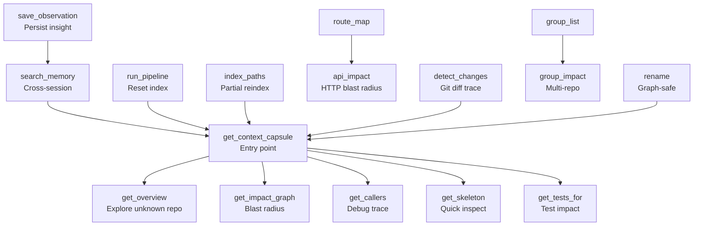
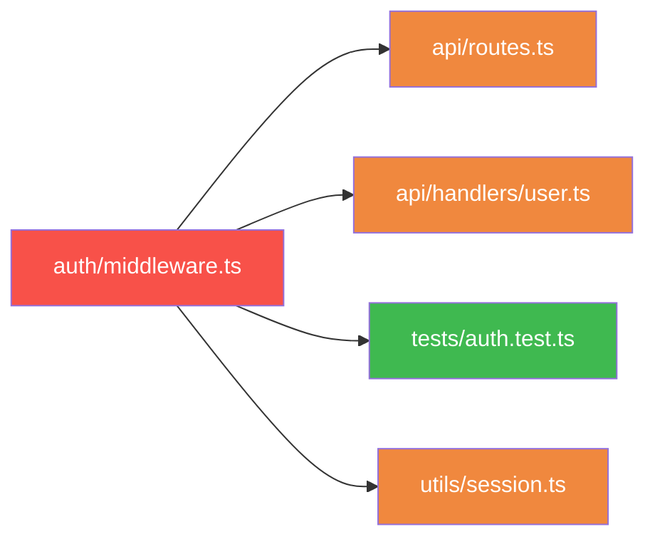
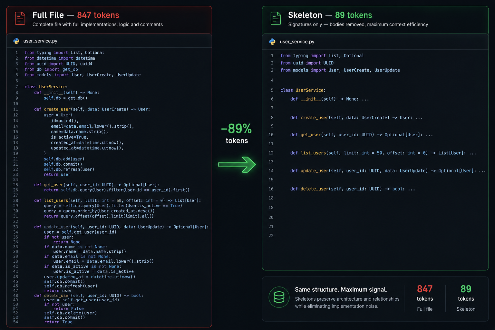
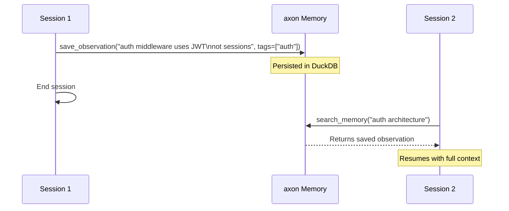
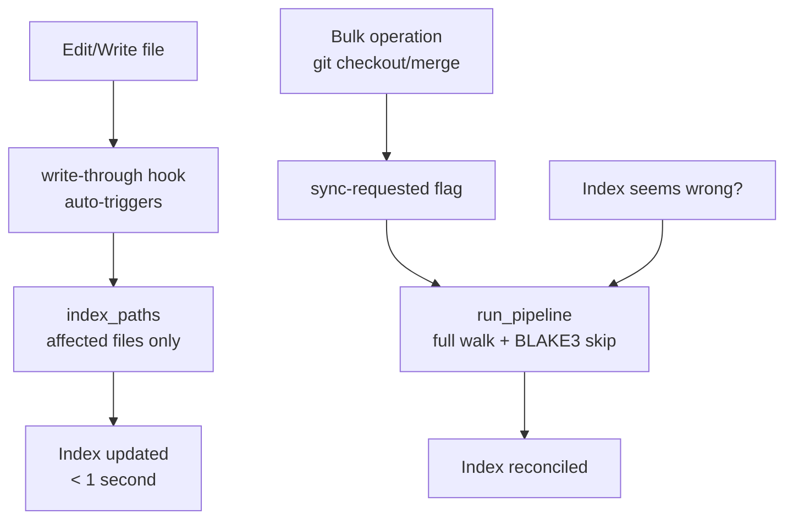

# Referência de Ferramentas MCP

O axon expõe 15 ferramentas MCP ao Claude Code via protocolo JSON-RPC 2.0. Cada ferramenta está documentada abaixo com sua finalidade, parâmetros, valor de retorno, cenário de uso recomendado e um exemplo concreto.

O Claude Code invoca essas ferramentas automaticamente com base no contexto. Você também pode acioná-las explicitamente descrevendo o que deseja em linguagem natural.



---

## Ferramentas de Contexto Principal

---

### 1. `get_context_capsule`

**Finalidade**

Monta uma capsule de contexto com orçamento de tokens para uma query em linguagem natural. Arquivos-pivô — os mais relevantes para a query — chegam completos; arquivos de suporte (suas dependências e dependentes) chegam skeletonizados (apenas assinaturas, sem corpos de função). O resultado é um pacote compacto e de alto sinal contendo exatamente o contexto que o agente precisa.

Este é o ponto de entrada principal para a maioria das tarefas agentic.

**Parâmetros**

| Nome | Tipo | Obrigatório | Descrição |
|------|------|-------------|-----------|
| `query` | string | Sim | Descrição em linguagem natural do contexto necessário. Exemplo: `"como funciona a validação JWT"` |
| `pivot_files` | string[] | Não | Direciona quais arquivos são tratados como pivôs primários. Caminhos relativos à raiz do projeto. Quando omitido, o axon seleciona pivôs via busca semântica + grafo. |
| `token_budget` | integer | Não | Máximo de tokens a incluir na capsule. Padrão: 8192. Override com variável de ambiente `AXON_TOKEN_BUDGET`. |

**Retorna**

Texto da capsule montada contendo:
- Um comentário de cabeçalho listando arquivos-pivô e seus papéis
- Código-fonte completo dos arquivos-pivô (até o orçamento)
- Código-fonte skeletonizado dos arquivos de suporte (apenas assinaturas, preenchendo o orçamento restante)
- Marcadores de truncamento se arquivos adicionais foram encontrados mas excluídos

**Quando Usar**

Sempre que precisar entender uma feature, rastrear um bug, explorar um subsistema ou obter contexto antes de fazer uma alteração. Execute antes de ler arquivos individualmente manualmente.

**Exemplo**

Prompt no Claude Code:
```
Como funciona o rate limiter neste projeto?
```

Chamada MCP explícita equivalente:
```
get_context_capsule(query="como funciona o rate limiter")
```

Com direcionamento de pivô:
```
get_context_capsule(
  query="fluxo de validação JWT",
  pivot_files=["src/auth/jwt.ts", "src/middleware/auth.ts"],
  token_budget=12000
)
```

**Observações**

- Resultados são cacheados por `hash(query + token_budget)` por época de índice. O cache invalida automaticamente após qualquer reindexação.
- Use `axon capsule <query> --no-cache` via CLI para ignorar o cache.
- Sem `AXON_EMBEDDING_MODEL`, a fase de busca semântica é ignorada e os pivôs são selecionados apenas por centralidade no grafo.

---

### 2. `get_overview`

**Finalidade**

Retorna os arquivos mais acoplados e os símbolos mais referenciados no projeto — o "centro nervoso" do código. Use para se orientar antes de qualquer outra query.

**Parâmetros**

| Nome | Tipo | Obrigatório | Descrição |
|------|------|-------------|-----------|
| `limit` | integer | Não | Número de top arquivos e top símbolos a retornar. Padrão: 10. |

**Retorna**

Duas listas ranqueadas:
1. Top N arquivos por contagem de arestas de entrada (mais importados / mais dependidos)
2. Top N símbolos por contagem de referências (mais chamados / mais usados)

**Quando Usar**

- Onboarding em um projeto nunca visto antes.
- Iniciando uma sessão sem tarefa específica — oriente-se primeiro.
- Identificando os arquivos de maior impacto antes de um refactor amplo.

**Exemplo**

Prompt no Claude Code:
```
Me dê uma visão geral deste projeto.
```

Chamada explícita:
```
get_overview(limit=15)
```

---

### 3. `get_impact_graph`

**Finalidade**

Traversal BFS bidirecional — quais arquivos dependem dos arquivos fornecidos (e quais arquivos os fornecidos dependem). Revela o blast radius de uma mudança antes de você fazê-la.



**Parâmetros**

| Nome | Tipo | Obrigatório | Descrição |
|------|------|-------------|-----------|
| `files` | string[] | Sim | Caminhos relativos à raiz do projeto. Um ou mais arquivos a analisar. |

**Retorna**

Lista de arquivos dependentes com tipo de relacionamento para cada aresta:
- `imports` — importação direta
- `calls` — chamada em nível de símbolo (requer `granularity = "symbol"` na config)
- `extends` — herança de classe

**Quando Usar**

Antes de qualquer refactor, mudança de API ou deleção. Conheça cada arquivo que será afetado antes de escrever uma única linha.

**Exemplo**

Prompt no Claude Code:
```
Quais arquivos dependem de src/auth/token.ts?
```

Chamada explícita:
```
get_impact_graph(files=["src/auth/token.ts"])
```

Blast radius multi-arquivo:
```
get_impact_graph(files=["src/auth/token.ts", "src/auth/middleware.ts"])
```

---

### 4. `get_callers`

**Finalidade**

Rastreamento reverso — dado um nome de símbolo, retorna todos os arquivos que importam o arquivo onde esse símbolo é definido. Essencial para debugging: uma função está se comportando de forma incorreta — encontre todo lugar que a chama.

**Parâmetros**

| Nome | Tipo | Obrigatório | Descrição |
|------|------|-------------|-----------|
| `symbol_name` | string | Sim | Nome da função, classe ou variável a rastrear. |
| `file_path` | string | Não | Desambigua quando o mesmo nome de símbolo aparece em múltiplos arquivos. Relativo à raiz do projeto. |
| `limit` | integer | Não | Máximo de arquivos chamadores a retornar. Padrão: 20. |

**Retorna**

Lista de arquivos chamadores com:
- O caminho do arquivo
- O local de definição do símbolo (arquivo + linha)
- Tipo de relacionamento (imports/calls)

**Quando Usar**

Debugging de uma regressão ou comportamento inesperado. Comece aqui para encontrar todos os call sites, depois afunile com `get_skeleton`.

**Exemplo**

Prompt no Claude Code:
```
Quais arquivos chamam a função validateToken?
```

Chamada explícita:
```
get_callers(symbol_name="validateToken")
```

Com desambiguação:
```
get_callers(symbol_name="validateToken", file_path="src/auth/token.ts", limit=30)
```

**Observações**

Os resultados são granulares em nível de arquivo: indicam quais arquivos importam o arquivo definidor, não quais linhas exatas chamam o símbolo. Use `get_skeleton` nos arquivos retornados para afunilar nos call sites exatos.

---

### 5. `get_skeleton`

**Finalidade**

Visão apenas de assinaturas de arquivos — assinaturas de funções, classes, métodos, interfaces e tipos com suas docstrings, mas sem corpos de função. Uma inspeção estrutural rápida que tipicamente custa 70–95% menos tokens do que ler o arquivo completo.

**Parâmetros**

| Nome | Tipo | Obrigatório | Descrição |
|------|------|-------------|-----------|
| `files` | string[] | Sim | Um ou mais caminhos de arquivo (relativos à raiz do projeto) a skeletonizar. |

**Retorna**

Para cada arquivo:
- Lista de símbolos com: tipo (function/class/method/interface/type), assinatura, linha de início, linha de fim, docstring (se presente)

**Quando Usar**

- Após `get_callers` para identificar call sites exatos sem ler corpos completos de arquivo.
- Inspeção rápida da API pública de um módulo.
- Entender a estrutura de um arquivo grande antes de decidir o que ler por completo.



**Exemplo**

Prompt no Claude Code:
```
Mostre-me a API pública de src/api/router.ts sem as implementações.
```

Chamada explícita:
```
get_skeleton(files=["src/api/router.ts", "src/api/middleware.ts"])
```

---

### 6. `get_tests_for`

**Finalidade**

Retorna os arquivos de teste que importam os arquivos fonte fornecidos, detectados por convenção de caminho. Execute antes de fazer merge para saber exatamente quais testes cobrem os arquivos que você alterou.

**Parâmetros**

| Nome | Tipo | Obrigatório | Descrição |
|------|------|-------------|-----------|
| `files` | string[] | Sim | Arquivos fonte para encontrar testes. Caminhos relativos à raiz do projeto. |

**Retorna**

Lista de caminhos de arquivos de teste que importam diretamente os arquivos fornecidos.

**Quando Usar**

- Antes de fazer merge de um PR: confirme quais testes executar.
- Após editar um arquivo: encontre rapidamente o conjunto de testes relevante.
- Ao escrever novos testes: descubra a cobertura existente.

**Exemplo**

Prompt no Claude Code:
```
Quais testes cobrem src/auth/middleware.ts?
```

Chamada explícita:
```
get_tests_for(files=["src/auth/middleware.ts"])
```

**Observações**

A detecção é baseada em convenção de caminho. O axon reconhece padrões comuns:
- Diretórios `tests/`, `__tests__/`, `spec/`
- Padrões de nome `*.test.ts`, `*.spec.ts`, `*_test.py`, `*_spec.rb`

Arquivos de teste que importam um alvo indiretamente (por uma cadeia de importações) são encontrados via `get_impact_graph`.

---

## Ferramentas de Memória

---

### 7. `search_memory`

**Finalidade**

Busca semântica sobre observações salvas de sessões anteriores do Claude Code. Recupere descobertas, gotchas, notas arquiteturais e análises de causa raiz que de outra forma seriam perdidos quando a janela de contexto for limpa.

**Parâmetros**

| Nome | Tipo | Obrigatório | Descrição |
|------|------|-------------|-----------|
| `query` | string | Sim | Descrição em linguagem natural do que você quer recuperar. |
| `limit` | integer | Não | Máximo de observações a retornar. Padrão: 5. |

**Retorna**

Lista de observações correspondentes, cada uma com:
- `content`: o texto salvo
- `tags`: tags associadas
- `file_path`: arquivo associado (se houver)
- `similarity`: score de similaridade vetorial (0–1)
- `saved_at`: timestamp

**Quando Usar**

- No início de uma sessão em um projeto familiar: "O que descobrimos na última vez?"
- Antes de investigar um bug: verifique se uma causa raiz já foi encontrada.
- Retomando trabalho de longa duração em múltiplas sessões.

**Exemplo**

Prompt no Claude Code:
```
O que sabemos sobre o fluxo de autenticação de sessões anteriores?
```

Chamada explícita:
```
search_memory(query="autenticação JWT middleware problemas", limit=10)
```

**Observações**

Requer `AXON_EMBEDDING_MODEL` configurado. Sem o modelo, `search_memory` sempre retorna resultados vazios (não gera erro).

---

### 8. `save_observation`

**Finalidade**

Persiste um insight, descoberta ou nota arquitetural no DuckDB com um embedding vetorial para recuperação semântica futura. Observações salvas sobrevivem a reinicializações de sessão e limpezas da janela de contexto.

**Parâmetros**

| Nome | Tipo | Obrigatório | Descrição |
|------|------|-------------|-----------|
| `content` | string | Sim | O texto da observação a salvar. Pode ter qualquer comprimento. |
| `tags` | string[] | Não | Tags de metadados para filtragem e categorização. Exemplo: `["bug", "auth", "jwt"]` |
| `file_path` | string | Não | Associa a observação a um arquivo específico. Relativo à raiz do projeto. |

**Retorna**

ID da observação (integer) para referência futura.

**Quando Usar**

Após qualquer descoberta não-óbvia:
- Causa raiz de um bug
- Uma restrição arquitetural não documentada
- Um gotcha que desperdiçou tempo ("mudar esta ordem quebra X")
- Um mapa mental de um subsistema complexo

**Exemplo**

Prompt no Claude Code:
```
Salve esta descoberta: o middleware de auth valida JWT antes do rate limiting, não depois. Inverter esta ordem causa 401s em endpoints com limite de taxa atingido porque o token é consumido antes da verificação do limite.
```

Chamada explícita:
```
save_observation(
  content="middleware auth valida JWT antes do rate limiting. Inverter a ordem causa 401s em endpoints com rate limit atingido.",
  tags=["bug", "auth", "middleware", "gotcha"],
  file_path="src/middleware/auth.ts"
)
```



---

## Ferramentas de Gerenciamento de Índice



---

### 9. `run_pipeline`

**Finalidade**

Indexação completa do projeto — percorrer todos os arquivos, parsear, construir grafo, computar embeddings. A mesma operação que `axon index` via CLI.

**Parâmetros**

| Nome | Tipo | Obrigatório | Descrição |
|------|------|-------------|-----------|
| `root` | string | Não | Raiz do projeto a indexar. Padrão: raiz do projeto registrada no servidor MCP atual. |

**Retorna**

Estatísticas do índice:
- Arquivos indexados
- Símbolos encontrados
- Arestas resolvidas
- Tempo decorrido
- Status de embeddings

**Quando Usar**

- Primeira indexação de um projeto dentro do Claude Code.
- Após fazer checkout de um branch diferente com grandes mudanças estruturais.
- Se o índice parecer obsoleto ou corrompido (execute `axon status` primeiro para verificar a idade).

**Observações**

Durante o uso normal do Claude Code, o hook write-through (`axon-post-edit.sh`) chama `index_paths` automaticamente após cada edição de arquivo. Raramente será necessário `run_pipeline` no trabalho diário. Prefira `index_paths` para atualizações pontuais.

---

### 10. `index_paths`

**Finalidade**

Reindexação incremental de arquivos específicos. Muito mais rápido do que um run completo do pipeline.

**Parâmetros**

| Nome | Tipo | Obrigatório | Descrição |
|------|------|-------------|-----------|
| `paths` | string[] | Sim (exceto `prune` isolado) | Caminhos de arquivo a reindexar. Relativos à raiz do projeto. |
| `prune` | boolean | Não | Também remove arquivos deletados do índice. Pode ser usado sem `paths` após deleções. |

**Retorna**

Contagem de arquivos reindexados e (se com prune) contagem de entradas obsoletas removidas.

**Quando Usar**

- Após editar arquivos fora do Claude Code (em editor de terminal ou IDE).
- Após deletar ou renomear arquivos (`prune: true`).
- Normalmente não necessário durante sessões no Claude Code — o hook post-edit lida com isso automaticamente.

---

## Ferramentas Avançadas

---

### 11. `rename`

**Finalidade**

Rename de símbolo assistido pelo grafo em todo o projeto. Usa o grafo de dependências para encontrar cada referência, garantindo que nenhuma seja perdida.

**Parâmetros**

| Nome | Tipo | Obrigatório | Descrição |
|------|------|-------------|-----------|
| `symbol_name` | string | Sim | Nome atual do símbolo a renomear. |
| `new_name` | string | Sim | Novo nome para o símbolo. |
| `dry_run` | boolean | Não | Se `true`, visualiza os arquivos afetados sem escrever alterações. Padrão: `false`. |

**Retorna**

Lista de arquivos que seriam (ou foram) modificados, com números de linha para cada substituição.

**Quando Usar**

Renomeando uma função, classe, método ou variável que aparece em muitos arquivos. O grafo garante que cada importação, call site e re-exportação seja atualizado — não apenas ocorrências de texto (que poderiam perder importações com alias ou referências dinâmicas).

**Exemplo**

Prompt no Claude Code:
```
Renomeie a função authenticateUser para verifyToken em todo o projeto.
```

Visualizar primeiro (dry run):
```
rename(symbol_name="authenticateUser", new_name="verifyToken", dry_run=true)
```

Aplicar:
```
rename(symbol_name="authenticateUser", new_name="verifyToken")
```

---

### 12. `route_map`

**Finalidade**

Lista todas as rotas HTTP detectadas no projeto com seus arquivos handler. O axon detecta registros de rota em frameworks populares (Express, FastAPI, Gin, ASP.NET, etc.) via pattern matching AST.

**Parâmetros**

Nenhum.

**Retorna**

Lista de rotas, cada uma com:
- Método HTTP (GET, POST, PUT, DELETE, PATCH, etc.)
- Padrão de caminho (ex.: `/api/users/:id`)
- Caminho do arquivo handler

**Quando Usar**

- Navegando em um projeto de API desconhecido — encontre o handler de qualquer endpoint instantaneamente.
- Auditando todos os endpoints expostos.
- Antes de modificar um endpoint — combine com `api_impact` para entender o blast radius completo.

**Exemplo**

Prompt no Claude Code:
```
Mostre-me todas as rotas de API deste projeto.
```

---

### 13. `api_impact`

**Finalidade**

Retorna o arquivo handler e o grafo de impacto transitivo completo para uma rota HTTP específica. Responde: "se eu alterar esse endpoint, quais arquivos são afetados?"

**Parâmetros**

| Nome | Tipo | Obrigatório | Descrição |
|------|------|-------------|-----------|
| `route_path` | string | Sim | O padrão de caminho da rota a analisar. Exemplo: `/api/users/:id` |

**Retorna**

- Caminho e número de linha do arquivo handler
- Todos os arquivos no grafo de dependência transitiva desse handler (o blast radius completo)

**Quando Usar**

Antes de modificar qualquer endpoint de API. Entenda o escopo completo da mudança — do handler ao serviço à camada de dados — antes de escrever qualquer código.

**Exemplo**

Prompt no Claude Code:
```
Preciso alterar o endpoint /api/users/:id. Quais arquivos serão afetados?
```

Chamada explícita:
```
api_impact(route_path="/api/users/:id")
```

---

### 14. `detect_changes`

**Finalidade**

Retorna os símbolos e arquivos afetados por mudanças recentes no git. Usa git diff para identificar arquivos alterados, depois expande para seus dependentes downstream no grafo.

**Parâmetros**

| Nome | Tipo | Obrigatório | Descrição |
|------|------|-------------|-----------|
| `since` | string | Não | Ref git para comparar. Exemplos: `HEAD~3`, `main`, um SHA de commit. Padrão: `HEAD~1`. |

**Retorna**

Lista de arquivos alterados com:
- Símbolos modificados em cada arquivo
- Dependentes downstream (arquivos que importam os arquivos alterados)

**Quando Usar**

- No início de uma sessão em um branch de feature: entenda o que os commits recentes tocaram.
- Code review: mapeie rapidamente o blast radius real de um PR.
- Após um `git merge` ou `git rebase`: saiba o que você acabou de trazer.

**Exemplo**

Prompt no Claude Code:
```
Quais arquivos os últimos 3 commits alteraram, e o que mais pode ser afetado?
```

Chamada explícita:
```
detect_changes(since="HEAD~3")
```

Comparar com branch main:
```
detect_changes(since="main")
```

---

### 15. `group_list` / `group_impact`

**Finalidade**

Ferramentas multi-repositório para projetos registrados em `~/.axon/registry.json`.

- **`group_list`**: Lista todos os repos registrados e seus grupos.
- **`group_impact`**: Dado um caminho de arquivo, retorna quais arquivos em *outros* repos registrados dependem do mesmo caminho de módulo.

**Parâmetros**

`group_list`: nenhum.

`group_impact`:

| Nome | Tipo | Obrigatório | Descrição |
|------|------|-------------|-----------|
| `file` | string | Sim | Caminho para o arquivo (absoluto ou relativo à raiz do projeto atual) cujo impacto cross-repo você quer avaliar. |

**Retorna**

`group_list`: Lista de repos com nome, caminho raiz, caminho do banco de dados e membros de grupo.

`group_impact`: Para cada outro repo registrado, uma lista de arquivos que importam o caminho de módulo fornecido.

**Quando Usar**

- Em um setup de monorepo ou multi-repo onde pacotes são compartilhados.
- Antes de publicar uma biblioteca compartilhada: saiba quais repos consumidores serão afetados.
- Após alterar um utilitário compartilhado: identifique quais outros serviços precisam ser testados.

**Exemplo**

Listar todos os projetos registrados:
```
group_list()
```

Encontrar impacto cross-repo:
```
group_impact(file="packages/shared/event-types.ts")
```

Prompt no Claude Code:
```
Alterei packages/shared/event-types.ts. Quais outros repos do nosso registry dependem desse arquivo?
```

**Observações**

Os repos precisam ser indexados individualmente antes de aparecerem em `group_list`. Executar `axon index` na raiz de cada repo os registra automaticamente.

---

## Referência Rápida de Ferramentas

| Ferramenta | Parâmetros Principais | Caso de Uso Principal |
|------------|----------------------|----------------------|
| `get_context_capsule` | `query`, `pivot_files?`, `token_budget?` | Entender qualquer feature ou subsistema |
| `get_overview` | `limit?` | Onboarding em novo projeto |
| `get_impact_graph` | `files[]` | Conhecer blast radius antes de refatorar |
| `get_callers` | `symbol_name`, `file_path?`, `limit?` | Encontrar todos os call sites para debugging |
| `get_skeleton` | `files[]` | Inspecionar API do módulo sem ler corpos |
| `get_tests_for` | `files[]` | Encontrar testes a executar após editar |
| `search_memory` | `query`, `limit?` | Recuperar descobertas de sessões anteriores |
| `save_observation` | `content`, `tags?`, `file_path?` | Persistir insights arquiteturais |
| `run_pipeline` | `root?` | Reindexação completa (raramente necessário) |
| `index_paths` | `paths[]`, `prune?` | Atualização incremental de arquivos específicos |
| `rename` | `symbol_name`, `new_name`, `dry_run?` | Rename seguro pelo grafo em todo o projeto |
| `route_map` | — | Listar todos os endpoints de API |
| `api_impact` | `route_path` | Blast radius de um endpoint HTTP |
| `detect_changes` | `since?` | O que commits recentes tocaram? |
| `group_list` / `group_impact` | `file` (impact) | Blast radius cross-repo |
