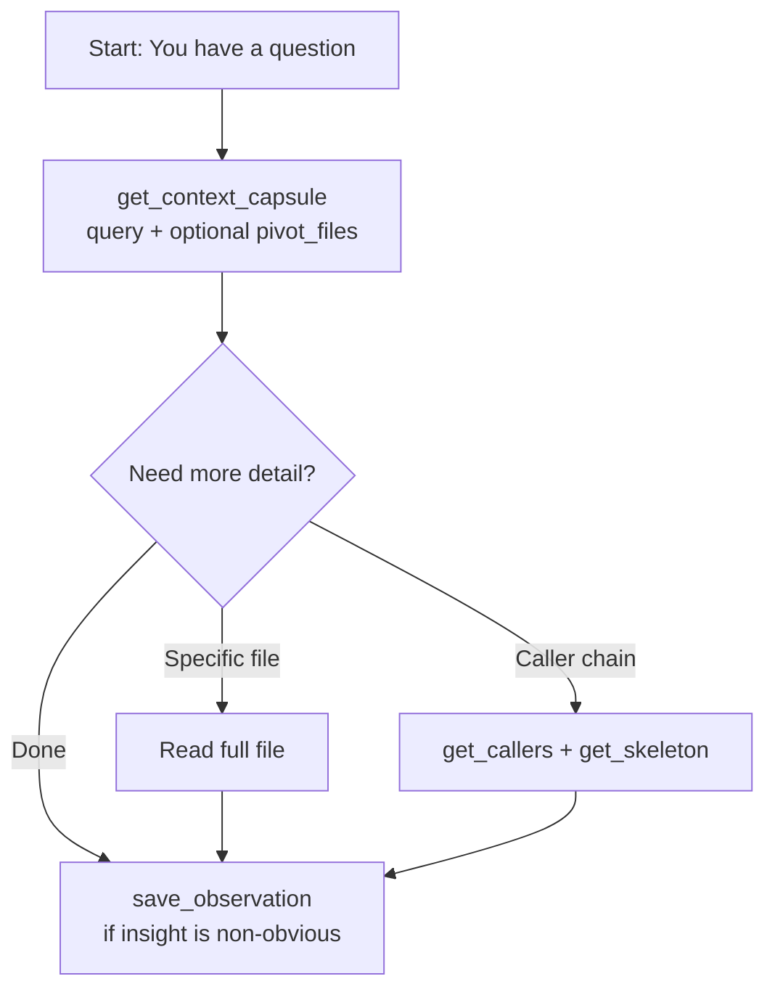
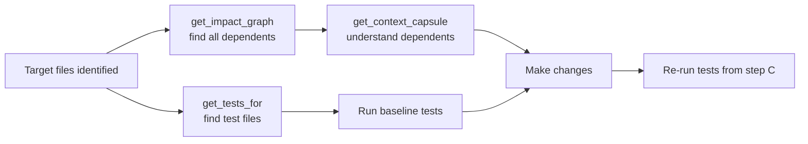
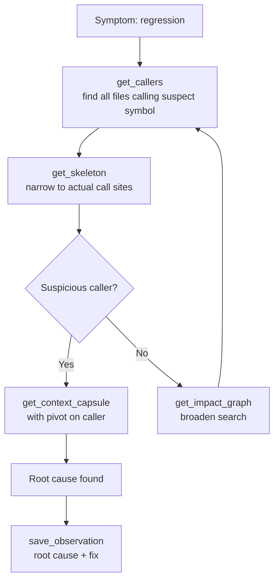
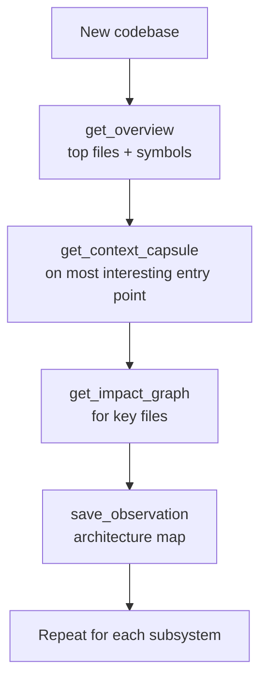
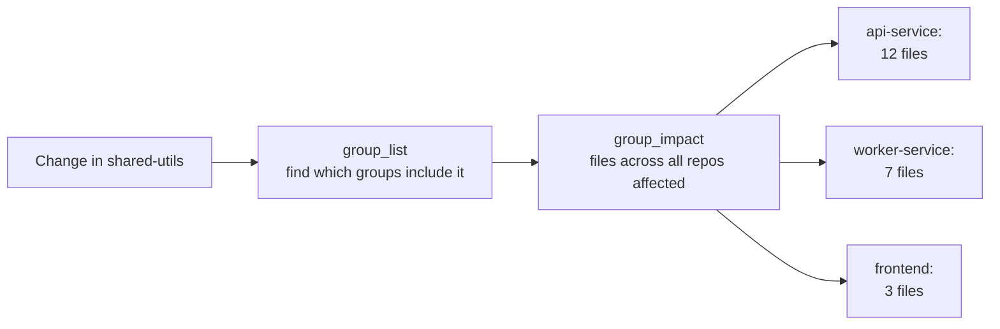
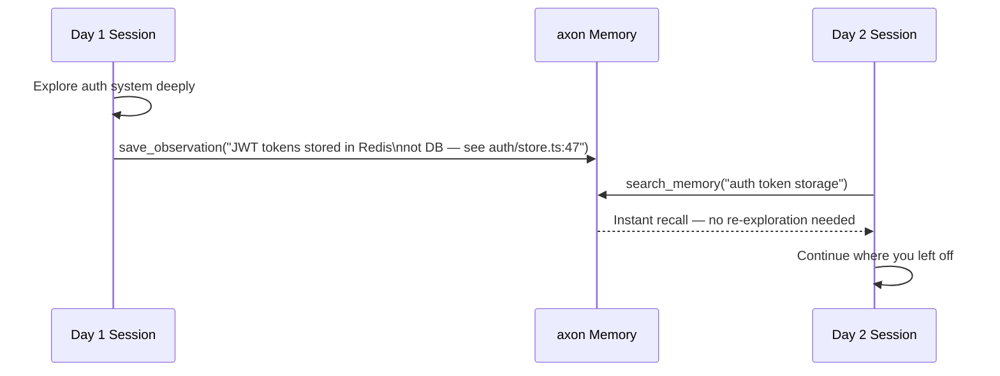

# Padrões de Fluxo Agentic

Este documento descreve workflows canônicos para usar o axon com o Claude Code. Cada workflow inclui o contexto, a sequência de ferramentas recomendada e prompts concretos que você pode usar no Claude Code.

---

## 1. Exploração Semântica — "Quero Entender Como X Funciona"

**Contexto:** Você precisa entender uma feature, subsistema ou fluxo de dados sem saber quais arquivos estão envolvidos.



**Sequência de ferramentas:**

```
get_context_capsule(query="<sua pergunta>")
  → ler arquivos-pivô se mais detalhes forem necessários
  → save_observation(content="<mapa mental>", tags=["overview", "<feature>"])
```

**Passo a passo no Claude Code:**

1. **Faça a pergunta em linguagem natural.** O axon seleciona os arquivos-pivô automaticamente.

   ```
   Como funciona o processamento de pagamentos neste projeto?
   ```

2. **Se a capsule cobrir tudo, ótimo.** Se precisar de mais profundidade em um arquivo específico:

   ```
   Mostre-me a implementação completa da classe PaymentService.
   ```

3. **Direcione a seleção de pivôs se já souber alguns arquivos relevantes.**

   ```
   Explique o fluxo de pagamento, focando em src/services/payment.ts e src/api/checkout.ts.
   ```
   *(Isso aciona `get_context_capsule` com `pivot_files` definido.)*

4. **Salve seu entendimento para sessões futuras.**

   ```
   Salve esta observação: o processamento de pagamento vai por PaymentService.charge() → StripeAdapter → confirmação via webhook. Reembolsos seguem uma fila assíncrona separada.
   ```

**Dicas:**
- Comece amplo, depois afunile: primeiro entenda a feature, depois leia implementações específicas.
- Use um orçamento de tokens maior para subsistemas complexos multi-arquivo: peça ao Claude para usar `token_budget=16000`.

---

## 2. Antes de um Refactor — "Vou Alterar a Função Y"

**Contexto:** Você quer alterar uma função, classe ou módulo. Antes de tocar em qualquer coisa, precisa saber o blast radius.



**Sequência de ferramentas:**

```
get_impact_graph(files=[<arquivos que planeja alterar>])
  → get_tests_for(files=[<arquivos que planeja alterar>])
  → get_context_capsule(query="<a mudança que planeja fazer>")
  → fazer as alterações
  → executar os testes retornados por get_tests_for
```

**Passo a passo no Claude Code:**

1. **Mapeie o blast radius primeiro.**

   ```
   Antes de alterar src/auth/middleware.ts, mostre-me todos os arquivos que dependem dele.
   ```

2. **Encontre os testes a executar.**

   ```
   Quais testes cobrem src/auth/middleware.ts?
   ```

3. **Obtenha contexto para a mudança.**

   ```
   Vou extrair a lógica de rate limiting de src/auth/middleware.ts para um módulo próprio. Me dê contexto para esse refactor.
   ```

4. **Faça as alterações.** A indexação write-through atualiza o grafo automaticamente.

5. **Execute os testes identificados.**

   ```
   Execute os arquivos de teste que você identificou para src/auth/middleware.ts.
   ```

**Dicas:**
- Se `get_impact_graph` retornar um conjunto muito grande de arquivos, considere se sua mudança não é ampla demais. Restrinja o escopo.
- Para um rename específico, use `rename` com `dry_run=true` primeiro para visualizar o impacto.

---

## 3. Depurando uma Regressão — "A Função Z Está Retornando Valores Errados"

**Contexto:** Uma função está se comportando de forma incorreta. Você precisa encontrar todos os call sites e rastrear o fluxo de dados.



**Sequência de ferramentas:**

```
get_callers(symbol_name="<função com problema>")
  → get_skeleton(files=[arquivos chamadores])     ← afunilar nos call sites reais
  → get_context_capsule(query="<hipótese do bug>", pivot_files=[chamadores mais suspeitos])
  → save_observation(content="causa raiz: ...", tags=["bug", "<módulo>"])
```

**Passo a passo no Claude Code:**

1. **Encontre todos os call sites.**

   ```
   Quais arquivos chamam a função calculateDiscount?
   ```

2. **Afunile para call sites sem ler corpos completos.**

   ```
   Mostre-me as assinaturas dos arquivos que chamam calculateDiscount.
   ```

3. **Obtenha contexto profundo sobre os chamadores mais suspeitos.**

   ```
   Acho que o bug está em como o fluxo de checkout chama calculateDiscount. Me dê contexto focado em src/checkout/order.ts e src/checkout/cart.ts.
   ```

4. **Após encontrar a causa raiz, salve.**

   ```
   Salve isso: calculateDiscount aplica cupons empilháveis antes de verificar as regras de exclusividade. Quando dois cupons exclusivos são empilhados, o desconto do segundo é aplicado mesmo devendo ser rejeitado. Correção: verificar exclusividade antes de aplicar qualquer cupom.
   Tags: bug, checkout, discount
   ```

**Dicas:**
- `get_callers` é granular em nível de arquivo. Faça um follow-up com `get_skeleton` para encontrar a linha exata.
- Se a função tiver um nome comum que aparece em vários arquivos, desambigue: "Quais arquivos chamam `validateToken` em `src/auth/token.ts`?"

---

## 4. Onboarding em Novo Projeto — "Acabei de Clonar Este Projeto"

**Contexto:** Você está começando do zero em um projeto desconhecido e precisa se orientar antes de qualquer trabalho produtivo.



**Sequência de ferramentas:**

```
get_overview(limit=10)
  → escolher arquivos/símbolos de interesse
  → get_context_capsule(query="<pergunta derivada do overview>")
  → get_skeleton(files=[top arquivos acoplados])   ← entender a superfície da API
  → save_observation(content="<mapa mental do projeto>", tags=["overview", "<nome-projeto>"])
```

**Passo a passo no Claude Code:**

1. **Comece com o overview — o centro nervoso do projeto.**

   ```
   Me dê um overview deste projeto. Quais são os arquivos e símbolos mais importantes?
   ```

2. **Mergulhe em um arquivo que parece central.**

   ```
   Mostre-me a API pública do arquivo mais acoplado (sem as implementações).
   ```

3. **Pergunte sobre a arquitetura geral.**

   ```
   Com base no overview, explique como os principais fluxos de dados percorrem este projeto.
   ```

4. **Explore um subsistema específico no qual você vai trabalhar.**

   ```
   Vou trabalhar no sistema de autenticação. Me dê uma capsule de contexto de como a autenticação funciona.
   ```

5. **Salve seu mapa mental.**

   ```
   Salve este overview: esta é uma API Express com camada de serviço (src/services/), acesso a dados via repositórios (src/repos/), e middleware em src/middleware/. Autenticação passa por JwtMiddleware → UserService → UserRepository. Entry point é src/server.ts.
   Tags: overview, arquitetura
   ```

**Dicas:**
- `get_overview` dá o mapa; `get_context_capsule` preenche o território.
- Salve o mapa mental imediatamente — ele ficará disponível em sessões futuras via `search_memory`.

---

## 5. Mudança em Endpoint de API — "Preciso Modificar o Endpoint /users"

**Contexto:** Você precisa alterar um endpoint HTTP específico e quer entender o impacto completo.

**Sequência de ferramentas:**

```
route_map()                                    ← encontrar o handler
  → api_impact(route_path="/users/:id")        ← blast radius completo
  → get_context_capsule(query="<o que precisa alterar>", pivot_files=[arquivo handler])
  → fazer as alterações
  → get_tests_for(files=[handler e arquivos de serviço])
```

**Passo a passo no Claude Code:**

1. **Liste todas as rotas para encontrar a que precisa.**

   ```
   Mostre-me todas as rotas de API deste projeto.
   ```

2. **Obtenha o blast radius completo para o endpoint alvo.**

   ```
   Qual é o grafo de impacto completo para o endpoint /api/users/:id?
   ```

3. **Obtenha contexto para sua mudança específica.**

   ```
   Preciso adicionar paginação ao endpoint GET /api/users. Me dê contexto para essa mudança.
   ```

4. **Faça as alterações.**

5. **Encontre e execute os testes relevantes.**

   ```
   Quais testes cobrem o handler do endpoint users e seu serviço?
   ```

**Dicas:**
- Use `route_map` primeiro mesmo que você acha que conhece o arquivo handler — o handler real pode ser diferente de onde a rota é registrada.
- `api_impact` frequentemente revela camadas de serviço e repositório que você pode não pensar em verificar.

---

## 6. Blast Radius Multi-Repositório — "Alterei um Utilitário Compartilhado"

**Contexto:** Você alterou um arquivo em uma biblioteca ou pacote compartilhado do qual outros repos no seu registry dependem.



**Sequência de ferramentas:**

```
group_list()                                    ← confirmar quais repos estão registrados
  → group_impact(file="<arquivo alterado>")    ← encontrar dependentes cross-repo
  → indexar cada repo afetado se obsoleto
  → get_tests_for em cada repo afetado
```

**Passo a passo no Claude Code:**

1. **Verifique seu registry.**

   ```
   Liste todos os repos registrados no meu registry do axon.
   ```

2. **Encontre o impacto cross-repo.**

   ```
   Alterei packages/shared/event-types.ts. Quais outros repos registrados dependem desse arquivo?
   ```

3. **Para cada repo afetado, encontre os arquivos dependentes.**

   ```
   No repo payments-service, mostre-me quais arquivos importam de event-types.ts.
   ```

4. **Encontre testes nos repos afetados.**

   ```
   Quais testes no payments-service cobrem os arquivos que usam event-types.ts?
   ```

**Dicas:**
- Todos os repos precisam ser indexados individualmente antes de aparecerem no registry. Execute `axon index` na raiz de cada repo.
- Use `axon serve --http --all` para expor um único endpoint HTTP agregando todos os repos registrados para inspeção via browser.

---

## 7. Memória Cross-Session — "Retomando o Trabalho Neste Projeto"

**Contexto:** Você está voltando a um projeto após uma pausa. Sessões anteriores podem ter salvo descobertas, causas raiz e notas arquiteturais.



**Sequência de ferramentas:**

```
search_memory(query="<área em que está trabalhando>")
  → ler observações relevantes
  → get_context_capsule(query="<tarefa atual>")   ← contexto fresco para o trabalho de hoje
```

**Passo a passo no Claude Code:**

1. **Recupere o que foi aprendido anteriormente.**

   ```
   O que sabemos sobre o sistema de autenticação de sessões anteriores?
   ```

2. **Pesquise tópicos específicos.**

   ```
   Pesquise na memória tudo relacionado a bugs de rate limiting.
   ```

3. **Obtenha contexto fresco para a tarefa de hoje.**

   ```
   Estou continuando o trabalho no fluxo de reembolso de pagamentos. Me dê contexto para isso.
   ```

4. **Salve as descobertas de hoje antes de encerrar a sessão.**

   ```
   Salve isso: o processador de reembolso usa uma fila assíncrona (BullMQ) e tenta até 3 vezes com backoff exponencial. Reembolsos que falham após 3 tentativas vão para a dead-letter queue em src/queues/dlq.ts. Tags: pagamentos, reembolsos, fila.
   ```

**Dicas:**
- Torne o ato de salvar observações um hábito ao final de cada sessão. Custa quase nada e gera dividendos em cada sessão futura.
- Tags tornam a recuperação futura muito mais precisa. Use tags consistentes: nomes de módulos, bug/feature/gotcha, números de PR.

---

## 8. Rename Seguro pelo Grafo — "Renomear authenticateUser para verifyToken"

**Contexto:** Uma função ou classe precisa ser renomeada em todo o projeto. Find-and-replace manual arrisca perder importações com alias, re-exportações e referências dinâmicas.

**Sequência de ferramentas:**

```
rename(symbol_name="authenticateUser", new_name="verifyToken", dry_run=true)
  → revisar a lista de arquivos afetados
  → rename(symbol_name="authenticateUser", new_name="verifyToken")  ← aplicar
  → get_tests_for(files=[arquivos modificados pelo rename])
  → executar testes
```

**Passo a passo no Claude Code:**

1. **Visualize o rename sem escrever alterações.**

   ```
   Visualize o rename de authenticateUser para verifyToken — mostre-me todos os arquivos afetados sem alterar nada ainda.
   ```

2. **Revise a lista.** Se estiver correta, aplique.

   ```
   Aplique o rename: authenticateUser → verifyToken.
   ```

3. **Encontre os testes a executar.**

   ```
   Quais testes cobrem os arquivos que foram modificados?
   ```

4. **Execute os testes para confirmar que não há quebras.**

**Dicas:**
- Use sempre `dry_run=true` primeiro. A visualização é rápida e gratuita.
- Se o nome do símbolo for comum (ex.: `validate`), use o parâmetro `file_path` para desambiguar: "Renomeie `validate` em `src/auth/validator.ts` para `validateAuthToken`."
- Após o rename, o hook write-through atualiza o índice automaticamente — nenhum `axon index` manual necessário.

---

## Referência Rápida de Workflows

| Situação | Comece com | Depois |
|----------|-----------|--------|
| Entender uma feature | `get_context_capsule` | `save_observation` |
| Antes de um refactor | `get_impact_graph` | `get_tests_for` |
| Debugging | `get_callers` | `get_skeleton` → `get_context_capsule` |
| Novo projeto | `get_overview` | `get_context_capsule` |
| Mudança em endpoint de API | `route_map` | `api_impact` → `get_context_capsule` |
| Mudança multi-repo | `group_list` | `group_impact` |
| Retomando trabalho | `search_memory` | `get_context_capsule` |
| Rename | `rename` (dry run) | `rename` (aplicar) → `get_tests_for` |
